# DSO202 Assignment 1: 3-Tier Kubernetes Deployment Technical Report

**Student Name:** Namgay Wangchuk  
**Namespace:** `dso202-assignment-01`  
**Architecture:** ARM64 (Apple Silicon)

---

## 1. Phase 1: Architecture Resolution & Image Lifecycle (Task 1 & 1.1.2)
**Objective:** Prepare the container environment and resolve hardware compatibility issues.

### 1.1 Technical Note (Task 1: Component Analysis)
Before any manifest was written, a comprehensive analysis of the Kubernetes architecture was required to ensure successful scheduling and runtime execution of the three-tier stack. 

**The Control Plane (Orchestration Layer):**
The lifecycle begins with the **kube-apiserver**, which serves as the central hub. It validates my YAML manifests for the namespace, deployments, and services, persisting the desired state into **etcd**. To follow the pattern established in **Practical 1**, I deployed a multi-node cluster. The **kube-scheduler** monitors the cluster for "unscheduled" pods. It performs a filtering and scoring process, ensuring that the control-plane node is reserved for cluster management and assigning my application workloads specifically to the **kind-worker** node.

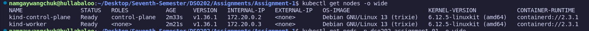

**The Node Components (Execution Layer):**
Once a pod is scheduled to the **kind-worker** node, the **kubelet** on that specific node takes over. It coordinates with the **Container Runtime (Docker)** via the CRI to pull my custom ARM64 images from Docker Hub. The kubelet ensures that the containers start according to the PodSpec and maintains the health of the pods. Simultaneously, **kube-proxy** on the worker node manages the virtual networking. It manipulates IPtables rules to ensure that internal traffic to the **Headless Service** (Database) and **ClusterIP** (Backend) is routed correctly, and that the **NodePort** (Frontend) is accessible to the host.

**Object Rationale:**
I selected **Deployments** for the Frontend and Backend to leverage the **ReplicaSet** controller, which maintains the "Actual State" of two backend replicas for high availability. For the Database, a **PersistentVolumeClaim (PVC)** was essential to ensure that data persisted beyond the lifespan of the pod, effectively separating the compute lifecycle from the data lifecycle.

### 1.2 Implementation & Challenges
As I am working on an **ARM64** machine, the provided standard images were incompatible. I performed a full "Build and Publish" workflow to ensure the `kubelet` could successfully execute the containers without architecture mismatch errors.

**Evidence: Docker Build and Push**

*Building the Database Image:*

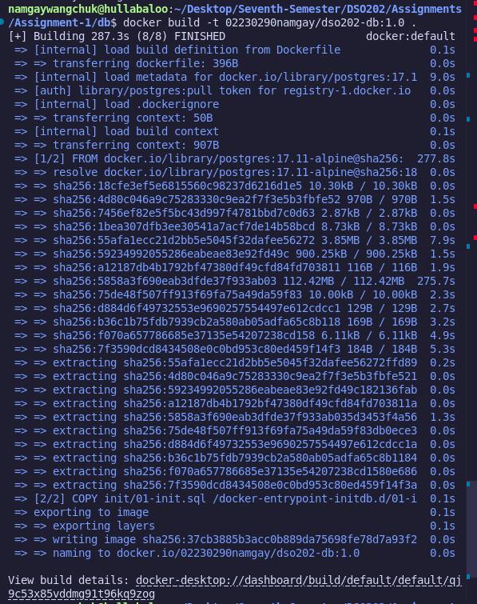

*Publishing DB Image:*

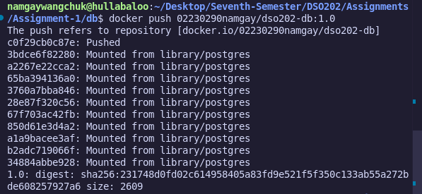

*Building the Backend Image:*

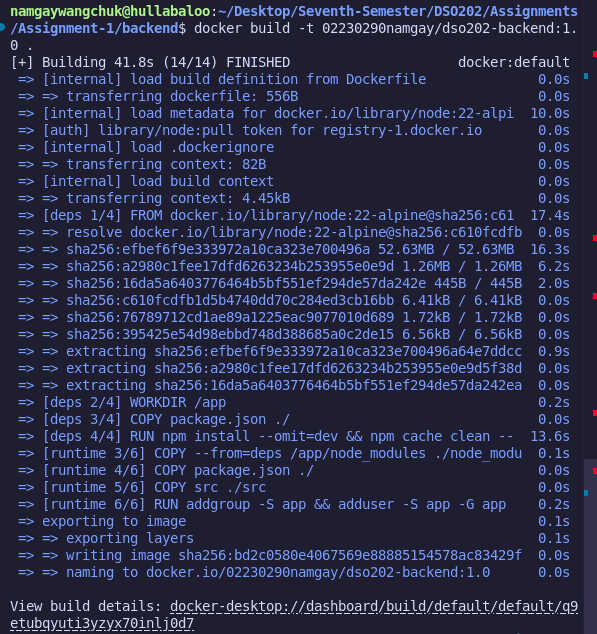

*Publishing Backend Image:*

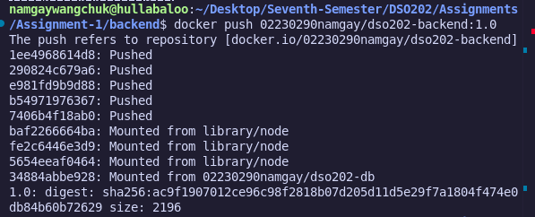

*Building the Frontend Image:*

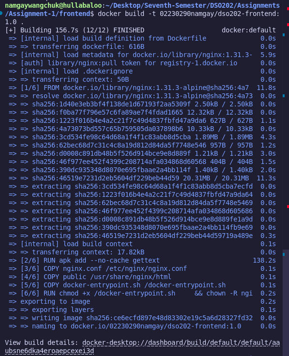

*Publishing Frontend Image:*

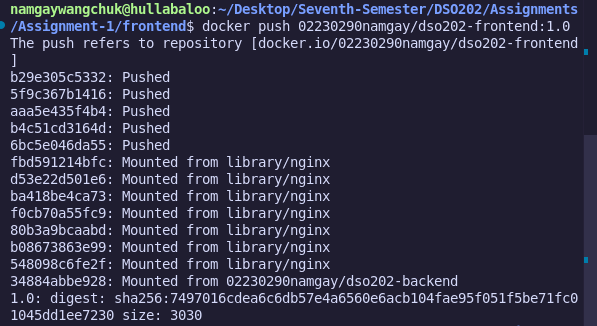

---

## 2. Phase 2: Cluster Initialization & Connectivity (Unit 1.1)
**Objective:** Setup the `kind` cluster with specific networking rules.

Following the pattern in **Practical 1**, I initialized the cluster using a custom `kind-config.yaml` with a dedicated control-plane and a worker node. To satisfy **Task 5**, I mapped **port 30081** to the host via the worker node. I initially mapped 30080, but removed it after identifying that it blocked the `kubectl port-forward` required for the secure `ClusterIP` Backend service.

**Evidence: Kind Cluster Creation**

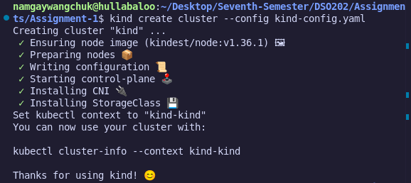

---

## 3. Phase 3: Declarative Deployment & Resource Governance (Task 2 - 6)
**Objective:** Deploying the application stack with isolation and resource boundaries.

I applied the manifests in a logical sequence, starting with the **Namespace & Governance (Task 6)**. I applied a `ResourceQuota` (1Gi RAM / 1 CPU) to provide a safety buffer while preventing any single tier from destabilizing the cluster nodes.

**Evidence: Pod Status and Multi-Node Verification**
*This output confirms that the scheduler correctly placed all application pods on the **kind-worker** node, leaving the control-plane node free for management tasks.*

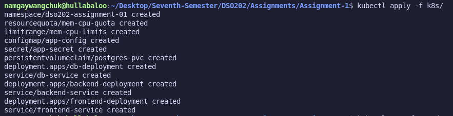

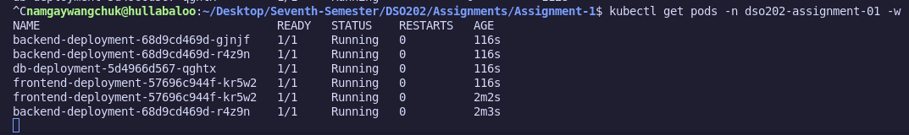

---

## 4. Phase 4: Functional Verification (Task 7)

### 4.1 Task 7a: Full CRUD Cycle
Using a `port-forward` for the backend on `30080` and the NodePort for the frontend on `30081`, I verified the full stack functionality.

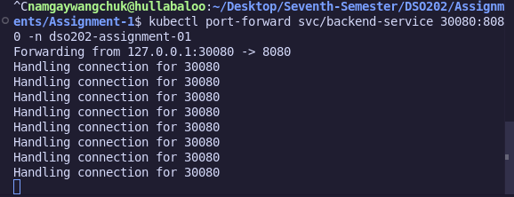

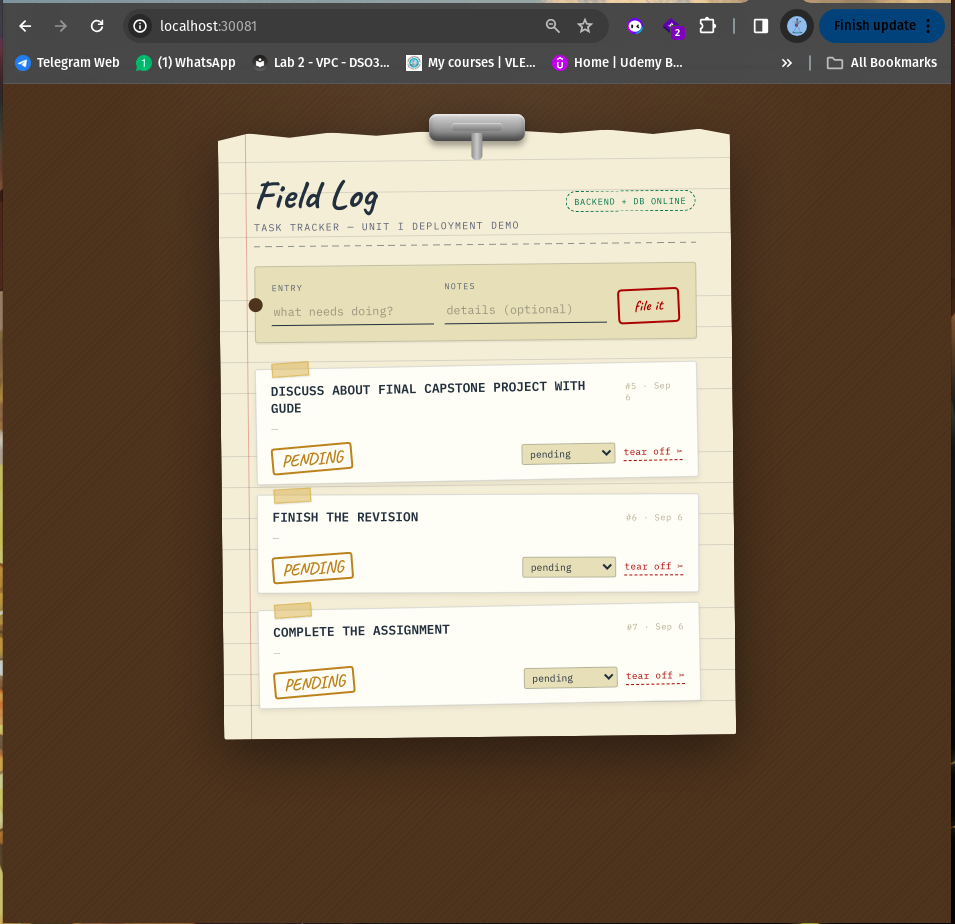

### 4.2 Task 7b: Service DNS Resolution
I used `curl` from inside the Frontend Pod to reach the Backend via its internal Service name, proving **CoreDNS** functionality.

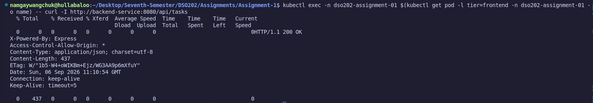

### 4.3 Task 7c: Self-Healing & Data Persistence
I deleted a backend pod and observed the **ReplicaSet** recreate it. I also deleted the DB pod and verified that my filed tasks were preserved by the PVC.

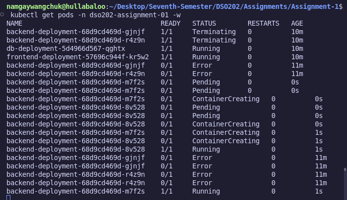

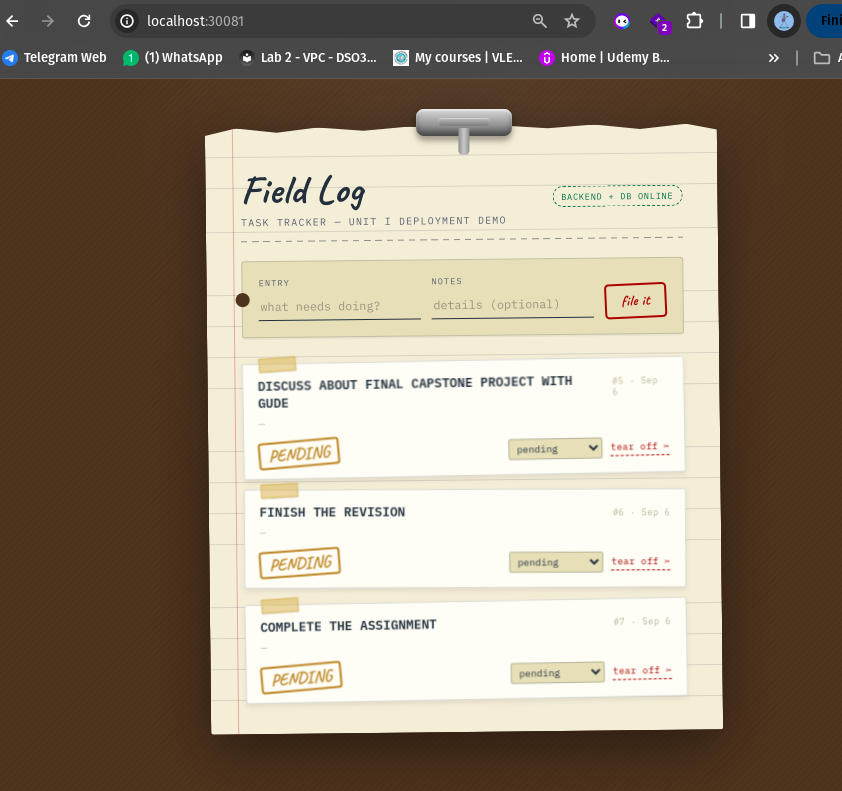

### 4.4 Task 7d: Declarative vs. Imperative Comparison
I created a pod imperatively to compare with my declarative YAMLs. The `ResourceQuota` successfully blocked this until I patched the limits, proving active governance.

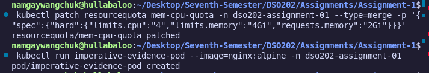

---

## 5. Challenges Faced & Resolutions
- **Challenge 1 (Architecture):** Incompatible images. *Resolution:* Rebuilt ARM64 images.
- **Challenge 2 (Port Conflict):** Port 30080 blocked by Kind mapping. *Resolution:* Cleaned `kind-config` to allow manual port-forward.
- **Challenge 3 (Governance):** Quota blocked imperative pod creation. *Resolution:* Patched quota limits.

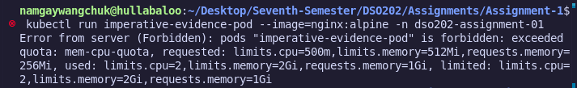

---

## 6. Conclusion
This assignment successfully demonstrates the power of Kubernetes as an orchestrator. By implementing persistence, internal service discovery, and resource governance on a multi-node cluster, I have created a resilient environment where the application can self-heal and protect its resources.