# DSO202 Assignment 2 Applying Unit 2 Concepts (StatefulSets & Ingress) to the Task Tracker Application

**Student Name:** Namgay Wangchuk
**Student ID:** 02230290
**Namespace:** `dso202-assignment-02`
**Builds on:** Assignment 1 (`dso202-assignment-01`); same application, same container images (`02230290namgay/dso202-*:1.0`)

---

## 1. Introduction

Assignment 1 deployed the Task Tracker's three tiers using only Unit 1 concepts: a single-replica Deployment with a PersistentVolumeClaim for the database, and a NodePort Service for external access to the frontend. Unit 2 introduces two mechanisms specifically designed to replace them once multi-replica identity and production-style traffic routing become relevant:

1. **StatefulSets**, for workloads where replicas are not interchangeable and each one needs a stable name, network identity, and its own storage. It's used here to re-architect the database tier.
2. **Ingress**, the standard mechanism for routing external HTTP traffic into a cluster through a single entry point. It's used here to replace the frontend's NodePort.

This report documents the reasoning behind each change, the concepts underneath them, the exact implementation steps taken, and the evidence gathered to verify each one actually works as intended.

---

## 2. Architecture

### 2.1 System overview: what changed vs. Assignment 1

| Aspect | Assignment 1 | Assignment 2 |
| --- | --- | --- |
| Database workload | `Deployment` (1 replica) + standalone PVC | `StatefulSet` (3 replicas) + `volumeClaimTemplates` |
| Database identity | Anonymous Pod, random suffix | Stable ordinal names: `db-0`, `db-1`, `db-2` |
| Database storage | One PVC (`postgres-pvc`), manually created | One PVC per replica, auto-generated (`data-db-0`, `data-db-1`, `data-db-2`) |
| Backend to DB connection | `DB_HOST=db-service` (any replica) | `DB_HOST=db-0.db-service` (pinned ordinal) |
| Frontend exposure | `NodePort` (`frontend-service`, port `30081`) | `ClusterIP`, reached only through Ingress |
| External entry point | Node's own IP:port, or `kubectl port-forward` | Single Ingress object on host `tasktracker.local` |
| Backend exposure | `ClusterIP` only (unchanged) | `ClusterIP` only, reached via Ingress path `/api` |

### 2.2 StatefulSet architecture (database tier)

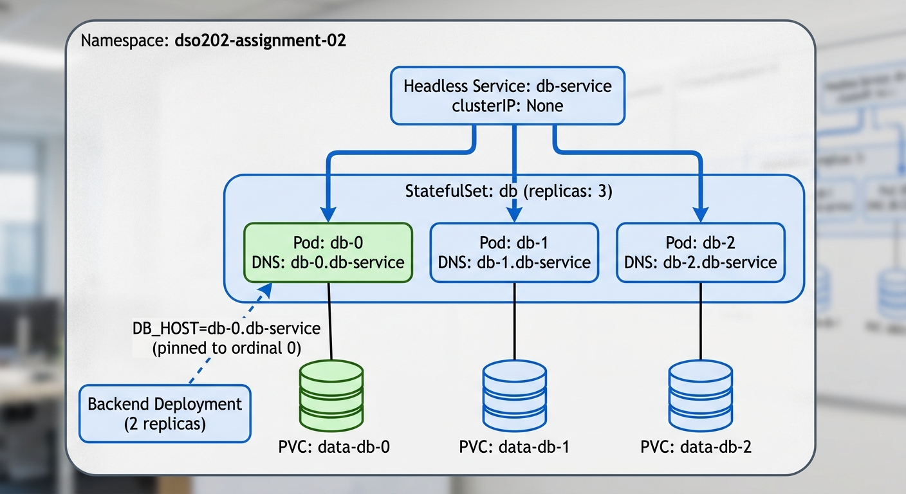

**Reading the diagram:** the headless Service does not load balance across the three Pods (that is the point of `clusterIP: None`); it instead gives each Pod its own resolvable DNS name. Creation proceeds `db-0 then db-1 then db-2`, each becoming Ready before the next starts. Each Pod is bound to its own PVC, generated from the same `volumeClaimTemplates` block but never shared. The backend deliberately talks only to `db-0`, since that is the only ordinal position configured as this application's actual database; `db-1` and `db-2` exist to demonstrate the StatefulSet mechanics (ordering, identity, per-replica storage) rather than to form a real Postgres replica set, which would require replication configuration outside this assignment's scope.

### 2.3 Ingress architecture (external traffic routing)

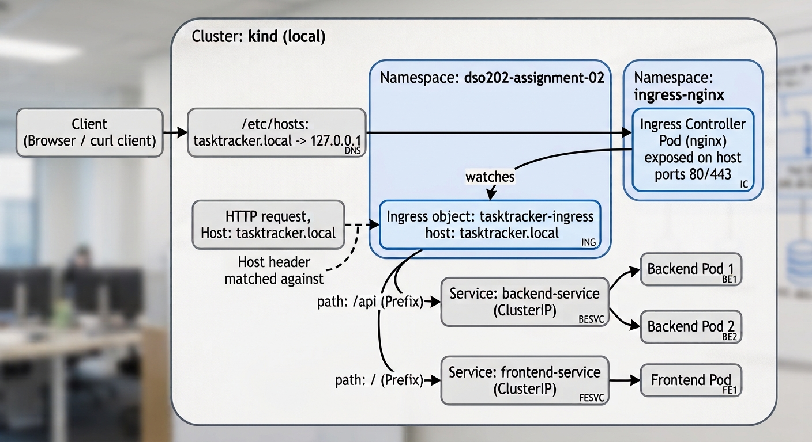

**Reading the diagram:** the Ingress *object* only declares the routing rules (which host and path go to which Service); it is the separately installed Ingress *controller* Pod that actually receives traffic on ports 80/443 and applies those rules. A request's path decides its destination: anything starting with `/api` goes to `backend-service`, everything else falls through to `frontend-service`. Neither backend nor frontend Service is exposed directly outside the cluster; the Ingress controller is the only component reachable from the host machine, via the `extraPortMappings` configured in `kind-config.yaml`.

---

## 3. Concept 1: StatefulSets

### 3.1 What problem it solves

A Deployment treats every replica as interchangeable: any Pod can be deleted and replaced by an identical one with a new random name and new internal IP, and nothing about correctness depends on which replica served which request. This was fine for Assignment 1's single-replica database, but it breaks down the moment more than one replica is required and those replicas are *not* interchangeable. For example, a database where one node is the writer and others are read replicas needs each node to know its own identity across restarts. A StatefulSet exists specifically to give each replica a stable name, a stable network address, and its own persistent storage that all survive rescheduling.

### 3.2 Mechanics actually used in this assignment

- **Ordinal naming.** The StatefulSet `db` with `replicas: 3` produces Pods named `db-0`, `db-1`, `db-2`, created in that order, each waiting for the previous one to be Ready (`podManagementPolicy: OrderedReady`).
- **Headless Service for stable DNS.** `db-service` has `clusterIP: None`, so instead of load balancing, cluster DNS resolves `db-0.db-service` directly to whichever Pod currently holds ordinal position 0, even if that Pod is deleted and recreated.
- **`volumeClaimTemplates`.** Rather than one shared PVC (which every replica would then fight over), Kubernetes generates one PVC per replica (`data-db-0`, `data-db-1`, `data-db-2`) and reattaches the same PVC to the same ordinal position if its Pod is ever rescheduled.
- **`persistentVolumeClaimRetentionPolicy`.** Set explicitly to `Retain` on both deletion and scale down, so that reducing `replicas` (or removing the StatefulSet entirely) never silently discards data. This is an explicit choice rather than relying on the cluster's implicit default.

### 3.3 Why the backend only talks to `db-0`

The official PostgreSQL image does not self configure streaming replication between `db-0`, `db-1`, and `db-2`. That would require additional application level configuration. Pinning `DB_HOST` to `db-0.db-service` is a deliberate, documented choice: it demonstrates that the *ordinal DNS identity* is stable and usable by a real application, while being honest that `db-1`/`db-2` are present to demonstrate StatefulSet mechanics (ordering, identity, independent storage) rather than to claim a working multi node database cluster that was not actually built.

---

## 4. Concept 2: Ingress

### 4.1 What problem it solves

Assignment 1 exposed the frontend with a `NodePort` Service, which opens a fixed port directly on every cluster node. This does not scale to a real application landscape: NodePort has no way to route based on hostname or URL path, it pushes arbitrary port numbers into URLs, and a separate NodePort (or cloud LoadBalancer) would be needed per application. Ingress solves this by introducing a single entry point that can route many different paths (or hostnames) to many different Services, using one Ingress controller instead of one exposed port per Service.

### 4.2 Ingress object vs. Ingress controller

This distinction is central to how the assignment was implemented and debugged:

- The **Ingress object** (`tasktracker-ingress`) is a passive configuration record. It declares *what* should route where, but does nothing by itself.
- The **Ingress controller** (the `ingress-nginx` Pod installed separately into the `ingress-nginx` namespace) is the active component that watches Ingress objects and actually forwards traffic. Creating an Ingress object with no controller running would be accepted by the API server and show up under `kubectl get ingress`, but would have no effect at all.

### 4.3 Path-based routing used here

A single Ingress object, on a single host (`tasktracker.local`), splits traffic by path:

| Path (Prefix match) | Routed to | Notes |
| --- | --- | --- |
| `/api` | `backend-service:8080` | No `rewrite-target` annotation needed; the backend's own routes already start with `/api`, so the forwarded path matches what it expects unmodified |
| `/` | `frontend-service:80` | Catches everything not matched by the more specific `/api` rule above |

`pathType: Prefix` was used for both rules rather than `ImplementationSpecific`, since Prefix matching is portable across Ingress controllers and its matching behaviour (a path and everything beneath it as a `/`-separated segment) is precisely defined rather than controller dependent.

### 4.4 Why the frontend Service changed from NodePort to ClusterIP

Once the Ingress controller is the component actually receiving external traffic (via the `kind` cluster's `extraPortMappings` for ports 80/443), the frontend Service no longer needs a NodePort of its own. The Ingress controller reaches it internally via `ClusterIP`, exactly the same way the backend was already reached.

### 4.5 Note on `BACKEND_URL`

`BACKEND_URL` was set to `http://tasktracker.local` with no `/api` suffix. The frontend's own JavaScript already appends `/api/...` when it calls the backend, so `BACKEND_URL` only needs to identify the host; the resulting `/api/...` request is then what the Ingress path rule matches and forwards to `backend-service`. Section 7 documents how an earlier, incorrect value of `http://tasktracker.local/api` produced a double `/api/api/...` path and a 404, and how the fix was diagnosed.

---

## 5. Implementation Walkthrough

### Phase 1: Cluster reconfiguration for Ingress

`kind` port mappings are fixed at cluster creation, so the Assignment 1 cluster could not simply be patched. It was recreated with `kind-config.yaml` labelling the worker node `ingress-ready=true` and mapping host ports 80/443.

```bash
kind delete cluster
kind create cluster --config kind-config.yaml
kubectl get nodes --show-labels | grep ingress-ready
```

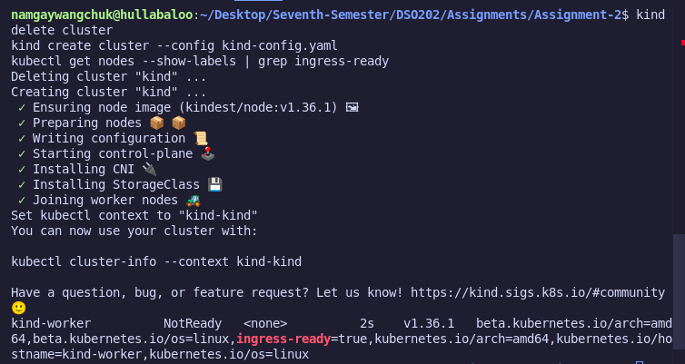

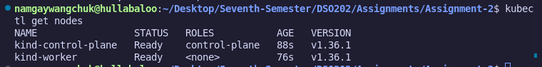

**[EVIDENCE 1 & 2]** Terminal output confirmed the worker node carries the `ingress-ready=true` label alongside the standard architecture and hostname labels, immediately after cluster creation. `kubectl get nodes` was run separately shortly after to confirm both `kind-control-plane` and `kind-worker` reached `Ready` status.

### Phase 2: Installing the Ingress controller

```bash
kubectl apply -f https://raw.githubusercontent.com/kubernetes/ingress-nginx/main/deploy/static/provider/kind/deploy.yaml
kubectl wait --namespace ingress-nginx \
  --for=condition=ready pod \
  --selector=app.kubernetes.io/component=controller \
  --timeout=120s
```

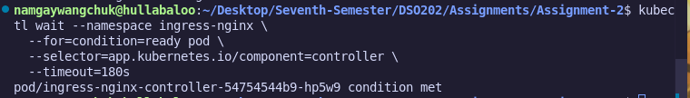

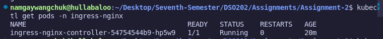

**[EVIDENCE 3 & 4]** All ingress-nginx objects (namespace, ServiceAccounts, RBAC, admission webhook jobs, and the controller Deployment) were created successfully. The initial `kubectl wait` call timed out at 120 seconds while the controller image was still starting; this was not a failure of the installation itself, only a false negative from too short a timeout. Running `kubectl get pods -n ingress-nginx` afterward showed the controller Pod at `1/1 Running`, and re-running the same `kubectl wait` command returned `condition met` immediately.

### Phase 3: Applying the namespace and governance

```bash
kubectl apply -f manifest/00-namespace.yaml
kubectl describe resourcequota mem-cpu-quota -n dso202-assignment-02
```

**Quota justification:** raised from Assignment 1's 1Gi/1 CPU because the database tier now runs 3 replicas instead of 1. With the LimitRange's default request of 256Mi/200m per container, 3 DB plus 2 backend plus 1 frontend equals 6 containers, requiring roughly 1.5Gi/1.2 CPU at minimum. The quota (`requests.memory: 2Gi`, `requests.cpu: "2"`, `limits.memory: 4Gi`, `limits.cpu: "4"`) was set with deliberate headroom above that figure rather than exactly at it.

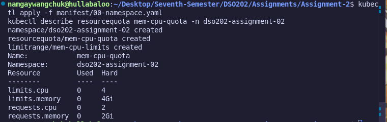

**[EVIDENCE 5]** The `describe resourcequota` output confirmed the namespace, ResourceQuota, and LimitRange were all created, with `Used` at `0` for every resource since nothing had been deployed into the namespace yet, and the `Hard` limits exactly matching the values justified above.

### Phase 4: Configuration and secrets

```bash
kubectl apply -f manifest/01-config.yaml
kubectl get configmap app-config -n dso202-assignment-02 -o yaml
```

Two values changed deliberately from Assignment 1, both documented in Section 2.1 above: `DB_HOST` now points at `db-0.db-service` instead of the old Deployment backed `db-service`, and `BACKEND_URL` now points at `http://tasktracker.local` instead of the old port-forwarded `http://localhost:30080` (see Section 4.5 for why no `/api` suffix belongs here).

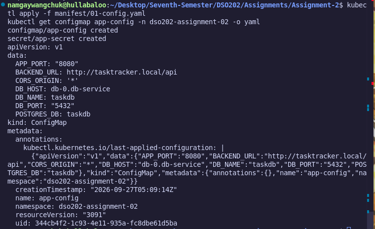

**[EVIDENCE 6]** The ConfigMap output showed `DB_HOST: db-0.db-service` and, after the correction described in Section 7, `BACKEND_URL: http://tasktracker.local`.

### Phase 5: Deploying the database StatefulSet

```bash
kubectl apply -f manifest/02-db-statefulset.yaml
kubectl get pods -n dso202-assignment-02 -l tier=database -w
```
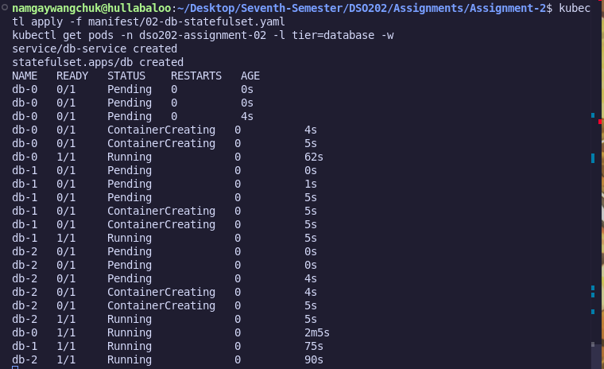

**[EVIDENCE 7]** The watch transcript showed `db-0` progress through `Pending`, `ContainerCreating`, and `Running` (reaching `1/1` at roughly 62 seconds, the slow part being PostgreSQL's own initialization), and only once `db-0` was `Running` did `db-1` begin at `0s`. The same pattern repeated for `db-2` starting only after `db-1` reached `Running`. This confirms the ordered creation guarantee from Section 2.1.5 of the Unit 2 notes: each replica is fully Ready before the next one starts.

```bash
kubectl get pvc -n dso202-assignment-02
```
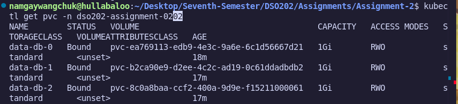

**[EVIDENCE 8]** The PVC list showed `data-db-0`, `data-db-1`, and `data-db-2` as three distinct, independently `Bound` 1Gi PVCs on the `standard` storage class, confirming one PVC per replica rather than one shared PVC.

```bash
kubectl run -it --rm dnsutils -n dso202-assignment-02 --image=busybox:1.36 -- \
  nslookup db-0.db-service.dso202-assignment-02.svc.cluster.local
```

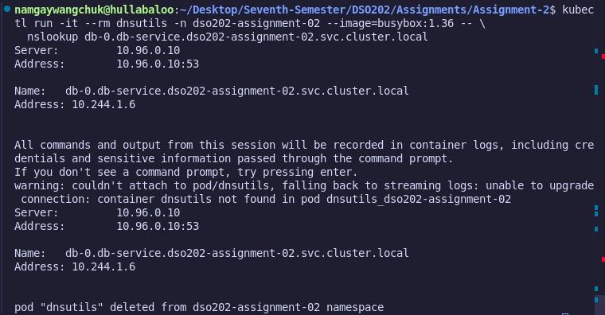

**[EVIDENCE 9]** The lookup resolved `db-0.db-service.dso202-assignment-02.svc.cluster.local` directly to a specific Pod IP address, rather than a load balanced ClusterIP, demonstrating the headless Service stable identity described in Section 2.1.5.


### Phase 6: Deploying backend and frontend

```bash
kubectl apply -f manifest/03-backend.yaml
kubectl apply -f manifest/04-frontend.yaml
kubectl get pods -n dso202-assignment-02
kubectl get svc -n dso202-assignment-02
```

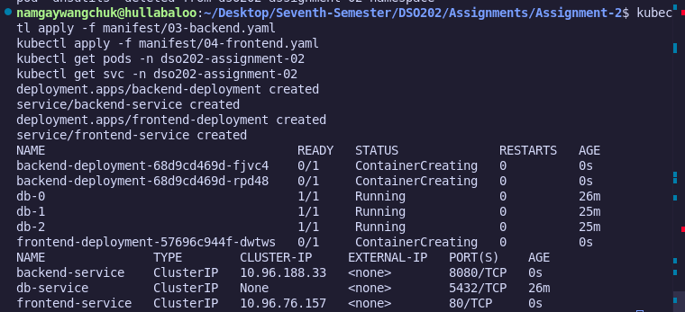

```bash
kubectl get pods -n dso202-assignment-02
```
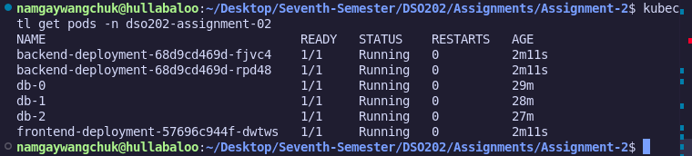

**[EVIDENCE 10 & 11]** All Pods (2 backend replicas, 3 database replicas, 1 frontend) reached `1/1 Running`. The Service list confirmed `frontend-service` and `backend-service` were both `ClusterIP` with no NodePort or LoadBalancer anywhere in the namespace, and `db-service` remained headless (`None` in the cluster IP column).

### Phase 7: Deploying the Ingress

```bash
kubectl apply -f manifest/05-ingress.yaml
kubectl get ingress -n dso202-assignment-02
kubectl describe ingress tasktracker-ingress -n dso202-assignment-02
```

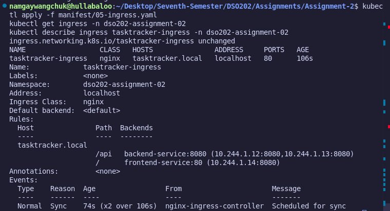

**[EVIDENCE 12]** `describe ingress` showed both path rules with resolved backend endpoint IPs: `/api` routing to `backend-service:8080` with both backend replica IPs listed, and `/` routing to `frontend-service:80` with the frontend Pod's IP. The events section confirmed the nginx controller synced the object immediately. The `ADDRESS` column in `kubectl get ingress` was briefly blank immediately after creation and populated to `localhost` a few seconds later, purely a timing effect rather than an error.

Add the demo hostname to the local hosts file:

```
127.0.0.1 tasktracker.local
```

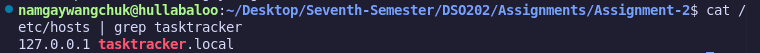

**[EVIDENCE 13]** Confirmed via `cat /etc/hosts | grep tasktracker` and a screenshot of the added line.

---

## 6. Verification

### 6.1 Ingress routing: frontend

```bash
curl -I http://tasktracker.local/
```

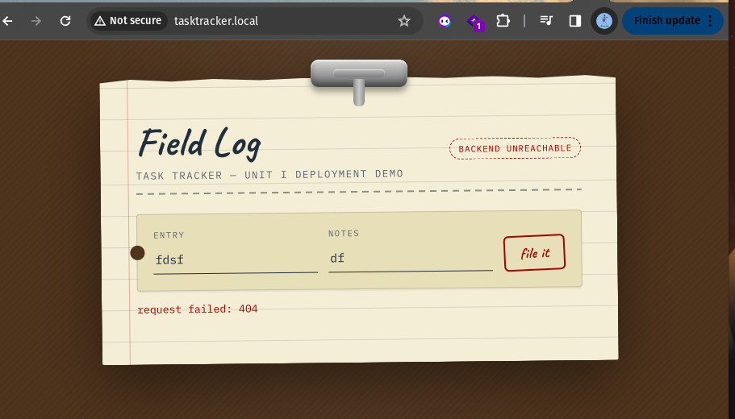

**[EVIDENCE 14]** The frontend page loaded fully through the Ingress, on port 80, with no NodePort or port-forward involved. HTML, CSS, and JS were all served correctly. At this stage the page displayed a "Backend unreachable" state due to the `BACKEND_URL` issue described in Section 7; this is discussed there rather than repeated here.

### 6.2 Ingress routing: backend, path-based

```bash
curl http://tasktracker.local/api/tasks
```

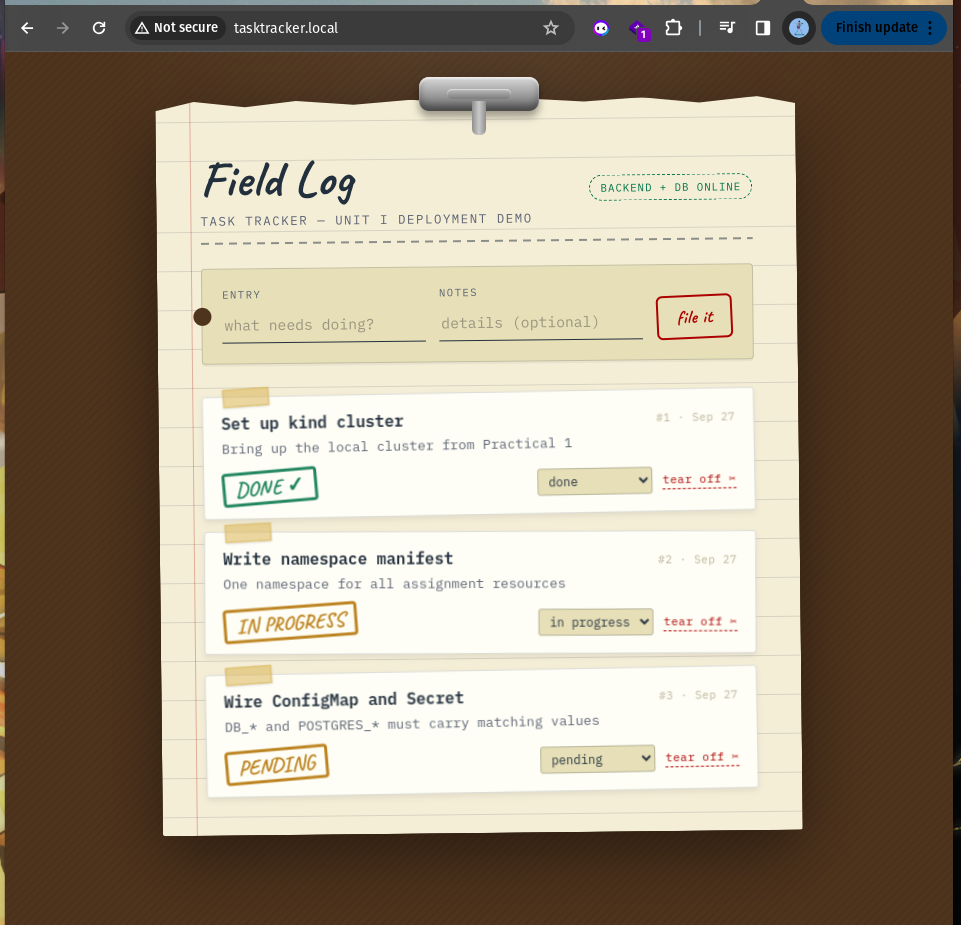

**[EVIDENCE 15]** After the `BACKEND_URL` correction in Section 7, the page displayed "BACKEND + DB ONLINE" and successfully listed the seeded task, confirming the full path from browser through Ingress through frontend through backend through `db-0` was working end to end.

### 6.3 Full CRUD cycle through the Ingress host

Performed in the browser at `http://tasktracker.local/`, exactly as in Assignment 1's Task 7a, but now reached entirely through the Ingress rather than a port-forward.

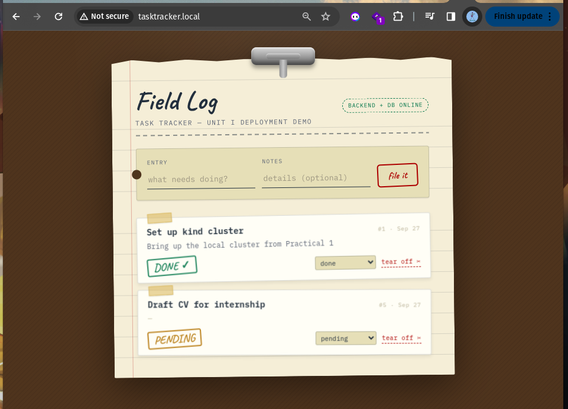

**[EVIDENCE 16]** Create: a new task ("Draft CV for internship") was submitted through the form and appeared in the list with status `PENDING`, alongside the pre-existing seeded task, unaffected.

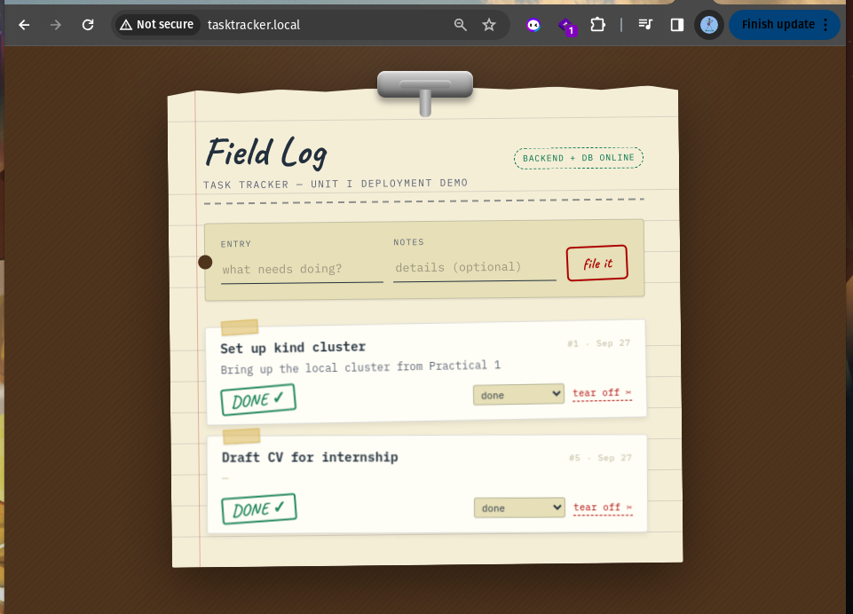

**[EVIDENCE 17]** Update: the new task's status was changed from `pending` to `done` via its dropdown; the change was reflected immediately, and the unrelated task remained unchanged, confirming the update only touched the intended record.

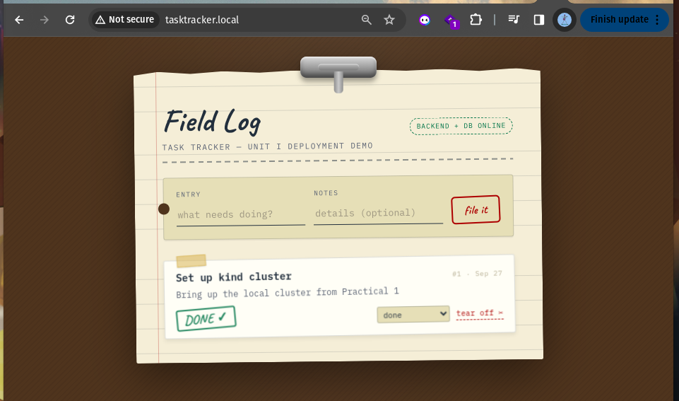

**[EVIDENCE 17]** Delete: the new task was removed via its "tear off" control and no longer appeared in the list, while the original seeded task remained present and correct.

### 6.4 StatefulSet scale-down and PVC retention

```bash
kubectl scale statefulset db -n dso202-assignment-02 --replicas=2
kubectl get pods -n dso202-assignment-02 -l tier=database
kubectl get pvc -n dso202-assignment-02
```

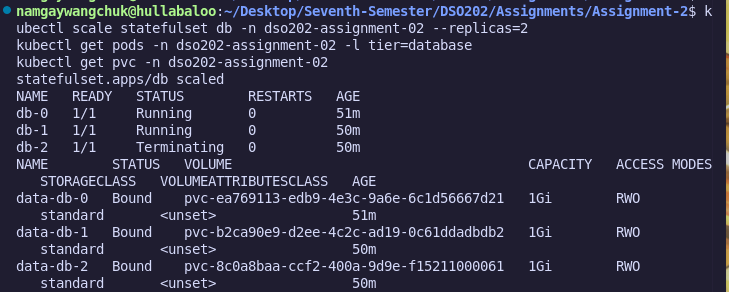

**[EVIDENCE 18]** Scaling to 2 replicas removed `db-2` (the highest ordinal, confirming reverse-order deletion as Section 2.1.5 predicts), shown transitioning through `Terminating`. Critically, `data-db-2` remained listed as `Bound` in the PVC output even after its Pod was gone, confirming the `Retain` policy set in Phase 5.

```bash
kubectl scale statefulset db -n dso202-assignment-02 --replicas=3
kubectl get pods -n dso202-assignment-02 -l tier=database -w
```

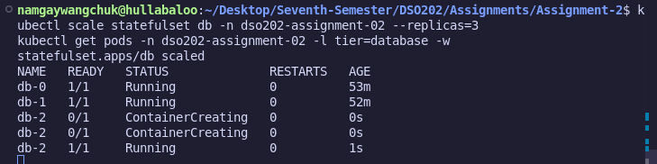

**[EVIDENCE 19]** Scaling back to 3 replicas recreated `db-2`, which reached `Running` in roughly 1 second, noticeably faster than its original ~5+ second creation. This is consistent with reattaching to the pre-existing `data-db-2` PVC rather than provisioning and initializing a fresh, empty volume.

### 6.5 Data persistence after deleting the primary replica

```bash
kubectl delete pod db-0 -n dso202-assignment-02
kubectl get pods -n dso202-assignment-02 -l tier=database -w
```

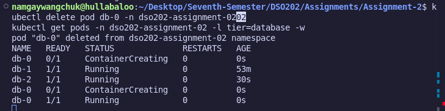

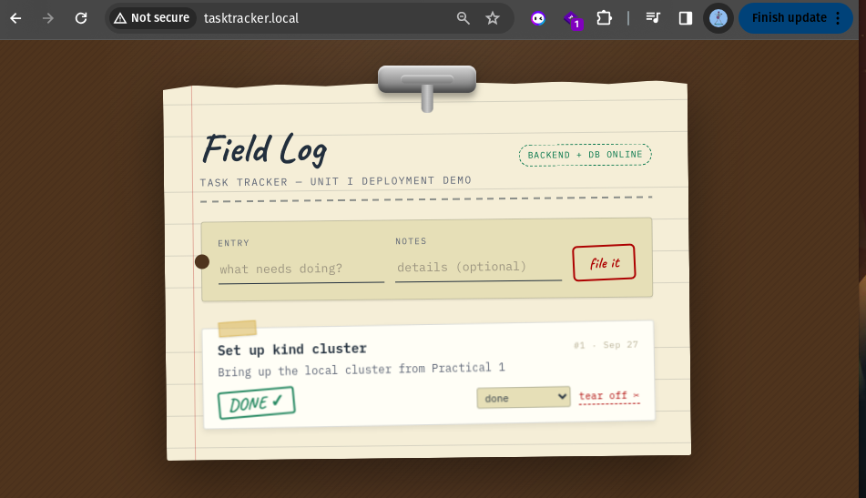

**[EVIDENCE 20]** Deleting `db-0` specifically (the ordinal the backend is pinned to) triggered its recreation while `db-1` and `db-2` were left untouched. Reloading the application in the browser afterward still showed "BACKEND + DB ONLINE" with the original seeded task still present, confirming the data survived the Pod's deletion because it lived on the PVC rather than the container, independent of Pod lifecycle exactly as Assignment 1's Task 7c demonstrated for the Deployment based database.

---

## 7. Challenges Faced & Resolutions

**Challenge 1: system Apache already occupying port 80.**
Recreating the `kind` cluster with the `extraPortMappings` for ports 80 and 443 initially failed with a Docker error: `bind: address already in use`. 

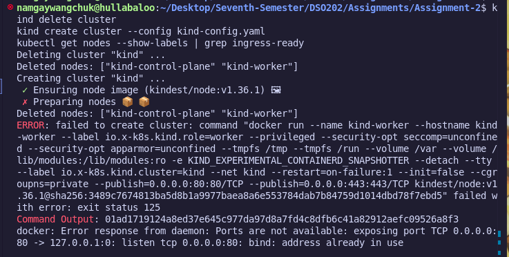

Running `sudo ss -tlnp | grep :80` showed a system `apache2` service already listening on port 80. 

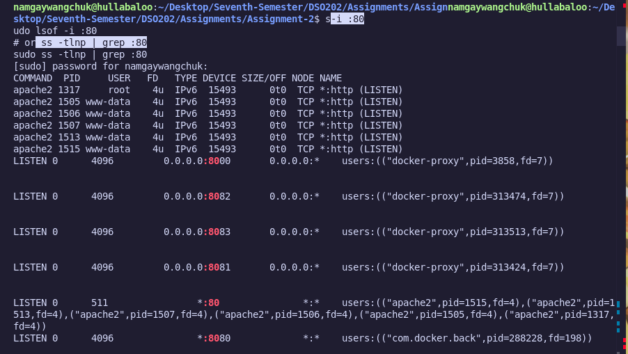

Since this machine is also used for other coursework, Apache was stopped for the duration of this assignment rather than removed, using `sudo systemctl stop apache2`, and `ss` was re-run to confirm port 80 was free before recreating the cluster. Apache remains stopped only until the next manual start or reboot, so this does not permanently affect the machine.

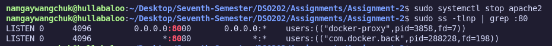

**Challenge 2: `kubectl wait` timing out on the Ingress controller.**
The first attempt to wait for the ingress-nginx controller Pod to become Ready timed out after 120 seconds, even though the object creation output showed everything applied without error. 

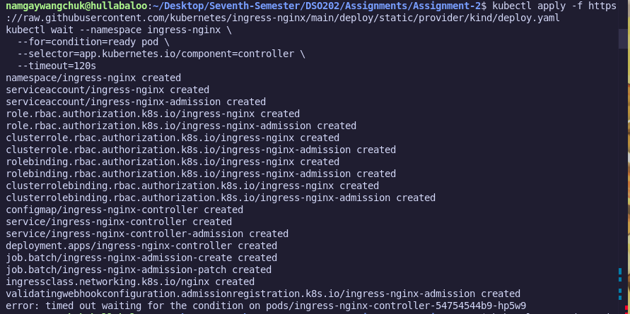

Checking `kubectl get pods -n ingress-nginx` directly showed the controller Pod was already `1/1 Running`; the timeout was simply too short relative to how long the controller image took to pull and start, not an actual failure. Re-running the identical `kubectl wait` command afterward returned `condition met` immediately.


**Challenge 3: double `/api` path producing a 404 on every backend call.**
After deploying the Ingress and loading the frontend at `http://tasktracker.local/`, the page loaded correctly but displayed "Backend unreachable" with `request failed: 404`. 


`BACKEND_URL` had been set to `http://tasktracker.local/api`, carried over from an assumption that the frontend needed the `/api` segment included in that value. Opening the browser's DevTools Network tab and inspecting the failed request showed the actual URL being called was `http://tasktracker.local/api/api/status`: the frontend's own JavaScript already appends `/api/...` when calling the backend, so the extra `/api` in `BACKEND_URL` produced a duplicated path that had no matching backend route. 

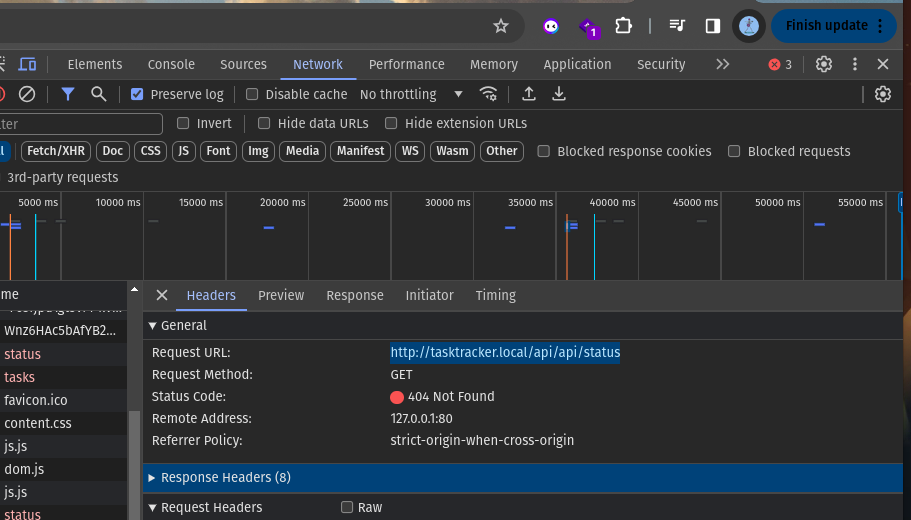

The fix was to change `BACKEND_URL` to `http://tasktracker.local` with no suffix, re-apply the ConfigMap, and restart the frontend Deployment (`kubectl rollout restart deployment frontend-deployment -n dso202-assignment-02`) so the running Pod picked up the corrected value through its startup `envsubst` substitution. After the restart and a hard browser refresh, the page correctly showed "BACKEND + DB ONLINE". 


This also confirmed the Ingress path routing itself (`/api` to backend, `/` to frontend) had been correct the entire time; the fault was isolated to the value the frontend was told to call, not the Ingress or Service layer.

---

## 8. Conclusion

This assignment converted two Unit 1-style constructs into their Unit 2 equivalents on the same application: a single-replica Deployment-plus-PVC database became a 3-replica StatefulSet with per-replica identity and storage, and a NodePort-exposed frontend became a single Ingress object routing by path to two internally-only Services. Both changes were verified functionally (ordered creation, stable DNS, per-replica PVC retention on scale-down and scale-up, path-based routing, a full CRUD cycle through the new entry point, and data persistence across Pod deletion) rather than only applied, consistent with the same "configuration must actually function, not merely exist" standard Assignment 1 was graded against. The two challenges encountered and resolved along the way (a port conflict at the infrastructure level, and a path-construction bug at the application-configuration level) reflect the kind of real, non-scripted debugging this assignment was intended to surface.