# DSO202 Practical 06: Kubernetes Package Management with Helm

---

## Executive Summary

This practical lab focuses on managing Kubernetes applications using **Helm 3**. In **Stage 1**,explored release management lifecycle operations, including chart repository setup, release installation, configuration updates, values merging, deployment failure simulation, automatic rollbacks, and OCI artifact management. In **Stages 2 through 5**, transitioned from managing external charts to scaffolding, developing, templating, linting, validating, and deploying a custom multi-environment Helm chart (`webapp`).

---

## Environment Setup & Prerequisites

* **Kubernetes Cluster:** Local Cluster
* **Namespace:** `dso202-helm`, `dso202-custom`, `dso202-dev`, `dso202-prod`
* **Helm Version:** Helm v3.x
* **Target Application:** `podinfo` (v6.15.0) & custom `webapp` chart

---

## Stage 1: Helm Release Lifecycle Management

### Step 1: Repository Management & Namespace Creation

Added the official `podinfo` Helm repository, refreshed the local cache, and created a dedicated namespace for testing:

```bash
helm repo add podinfo https://stefanprodan.github.io/podinfo
helm repo update
kubectl create namespace dso202-helm

```

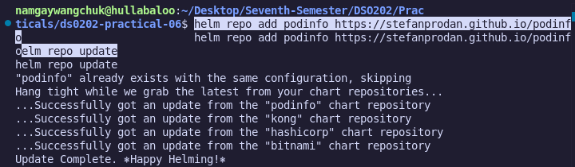

#### Verification:

```bash
helm repo list
kubectl get ns dso202-helm

```

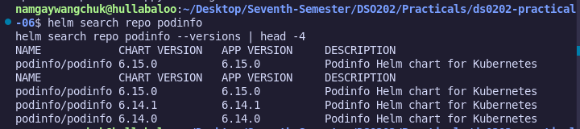

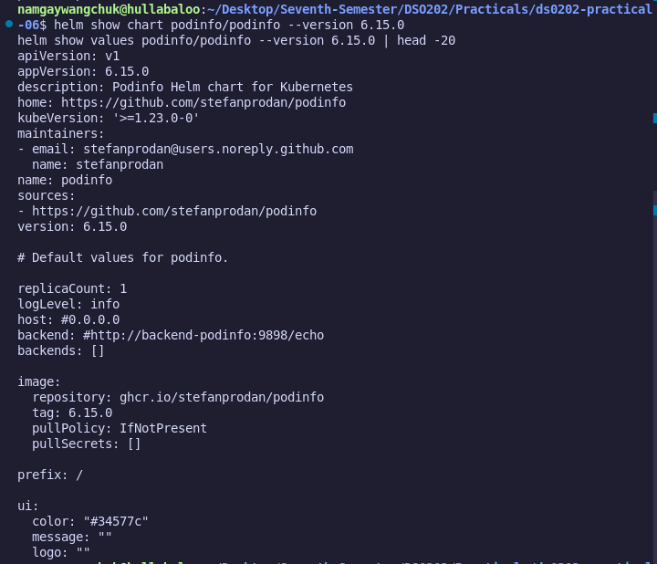

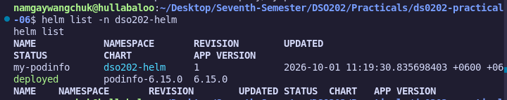

### Step 2: Release Installation

Installed the initial release named `my-podinfo` with custom parameters (replicas set to 2 and a custom message):

```bash
helm install my-podinfo podinfo/podinfo \
  --version 6.15.0 \
  -n dso202-helm \
  --set replicaCount=2 \
  --set ui.message="Hello from DSO202"

```

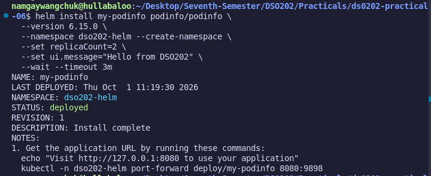

#### Key Verification Commands:

```bash
helm list -n dso202-helm
helm status my-podinfo -n dso202-helm
kubectl get pods,svc -n dso202-helm

```


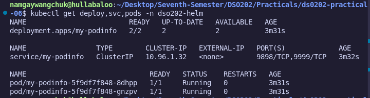

### Step 3: Application Endpoint Verification

To test application traffic, port forwarding was configured:

```bash
# Terminal 1: Port-Forward
kubectl -n dso202-helm port-forward deploy/my-podinfo 8088:9898

# Terminal 2: Test Endpoint
curl -s http://localhost:8088 | grep -E '"(version|message)"'

```

#### Output:

```json
"version": "6.15.0",
"message": "Hello from DSO202",

```
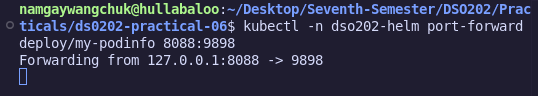

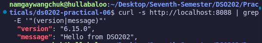

### Step 4: Secret-Based Release Storage Inspection

Helm stores release metadata as Kubernetes Secrets in the target namespace:

```bash
kubectl get secrets -n dso202-helm --show-labels

```
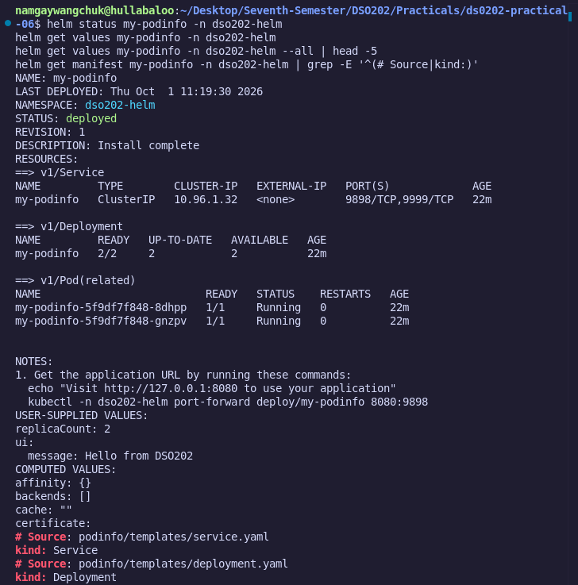

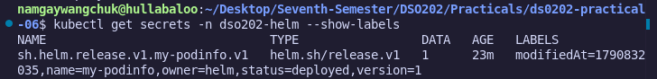


Decoding and extracting the underlying release state JSON:

```bash
kubectl get secret sh.helm.release.v1.my-podinfo.v1 -n dso202-helm \
  -o jsonpath='{.data.release}' | base64 -d | base64 -d | gunzip \
  | jq '{name, namespace, version, status: .info.status, apply_method, values: .config}'

```

#### Output:

```json
{
  "name": "my-podinfo",
  "namespace": "dso202-helm",
  "version": 1,
  "status": "deployed",
  "apply_method": "ssa",
  "values": {
    "replicaCount": 2,
    "ui": {
      "message": "Hello from DSO202"
    }
  }
}

```

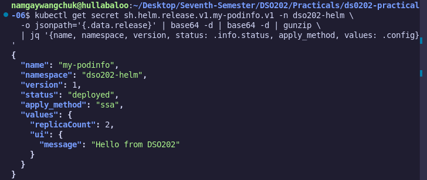

### Step 5: Helm Upgrade & Value Inheritance

Upgraded the release to Revision 2 by setting a custom UI color:

```bash
helm upgrade my-podinfo podinfo/podinfo \
  --version 6.15.0 -n dso202-helm \
  --set ui.color="#2e7d32"

```

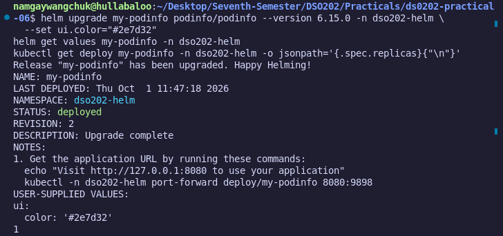

### Step 6: Values Merging (--reuse-values)

Restored original configurations while preserving the new UI color using the `--reuse-values` flag:

```bash
helm upgrade my-podinfo podinfo/podinfo --version 6.15.0 -n dso202-helm \
  --reuse-values --set replicaCount=2 --set ui.message="Hello from DSO202"

```

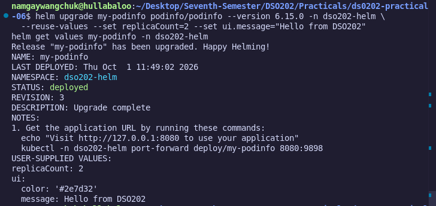

Resulting User Values (`helm get values my-podinfo -n dso202-helm`):

```yaml
USER-SUPPLIED VALUES:
replicaCount: 2
ui:
  color: '#2e7d32'
  message: Hello from DSO202

```

### Step 7: Simulating Deployment Failure

Simulated an invalid image deployment with a short wait timeout to trigger an intentional failure:

```bash
helm upgrade my-podinfo podinfo/podinfo --version 6.15.0 -n dso202-helm \
  --set image.tag="invalid-tag-999" \
  --wait --timeout 30s

```

Checking release history confirmed Revision 5 entered a failed state:

```bash
helm history my-podinfo -n dso202-helm

```

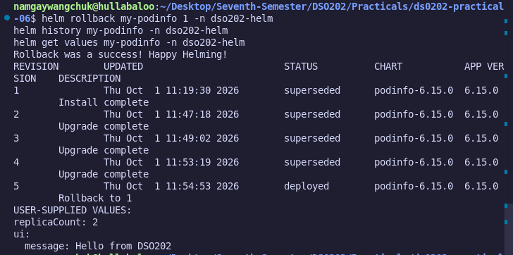

### Step 8: Release Rollback

Executed a rollback to revert to Revision 1:

#### Verification:

```bash
helm rollback my-podinfo 1 -n dso202-helm
helm history my-podinfo -n dso202-helm
kubectl get pods -n dso202-helm

```


The release history confirmed a new Revision (Revision 6) was generated with the description `Rollback to 1`.

### Step 9: OCI Repository Management (Optional Experiment)

Tested installing directly from an OCI container registry (`ghcr.io`):

```bash
helm show values oci://ghcr.io/stefanprodan/charts/podinfo --version 6.15.0 | head -n 3

helm install my-podinfo oci://ghcr.io/stefanprodan/charts/podinfo \
  --version 6.15.0 -n dso202-helm --set replicaCount=2

```

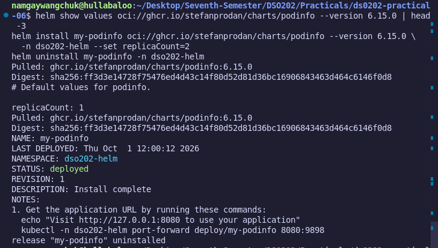

### Step 10: Stage Cleanup

Cleaned up all resources created in Stage 1:

```bash
helm uninstall my-podinfo -n dso202-helm
kubectl delete ns dso202-helm

```

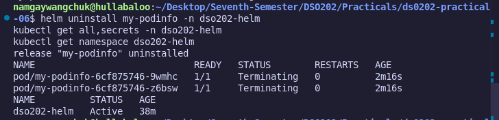

---

## Stage 2: Custom Chart Scaffolding (`webapp`)

### Step 1: Chart Generation & Cleanup

Scaffolded a clean chart directory named `webapp` and purged autogenerated boilerplate templates:

```bash
helm create scaffold
find scaffold -type f | sort
rm -rf scaffold

```

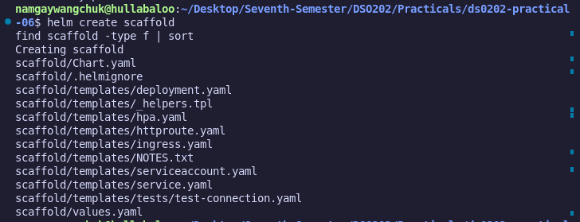

### Step 2: Chart Metadata Definition (`Chart.yaml`)

Configurm -rf scaffold
red chart metadata inside `webapp/Chart.yaml`:

```yaml
apiVersion: v2
name: webapp
description: A Helm chart for deploying Nginx web application
type: application
version: 0.1.0
appVersion: "1.30-alpine"

```

### Step 3: Default Values Configuration (`webapp/values.yaml`)

Defined default configurations inside `webapp/values.yaml`:

```yaml
replicaCount: 1

image:
  repository: nginx
  pullPolicy: IfNotPresent
  tag: ""

page:
  title: "Web App"
  environment: ""
  message: "Hello World"

service:
  type: ClusterIP
  port: 80

resources:
  requests:
    cpu: 50m
    memory: 32Mi
  limits:
    cpu: 200m
    memory: 64Mi

podAnnotations: {}

```

---

## Stage 3: Template Construction & Helper Functions

### Step 1: Named Helpers Construction (`webapp/templates/_helpers.tpl`)

Created standardized named templates adhering to Kubernetes recommended label sets and Go templating conventions:

```gotemplate
{{/* webapp.name: chart name or nameOverride */}}
{{- define "webapp.name" -}}
{{- default .Chart.Name .Values.nameOverride | trunc 63 | trimSuffix "-" }}
{{- end }}

{{/* webapp.fullname: object base name */}}
{{- define "webapp.fullname" -}}
{{- if .Values.fullnameOverride }}
{{- .Values.fullnameOverride | trunc 63 | trimSuffix "-" }}
{{- else }}
{{- $name := default .Chart.Name .Values.nameOverride }}
{{- if contains $name .Release.Name }}
{{- .Release.Name | trunc 63 | trimSuffix "-" }}
{{- else }}
{{- printf "%s-%s" .Release.Name $name | trunc 63 | trimSuffix "-" }}
{{- end }}
{{- end }}
{{- end }}

{{/* webapp.chart: chart name and version */}}
{{- define "webapp.chart" -}}
{{- printf "%s-%s" .Chart.Name .Chart.Version | replace "+" "_" | trunc 63 | trimSuffix "-" }}
{{- end }}

{{/* webapp.selectorLabels: immutable match labels */}}
{{- define "webapp.selectorLabels" -}}
app.kubernetes.io/name: {{ include "webapp.name" . }}
app.kubernetes.io/instance: {{ .Release.Name }}
{{- end }}

{{/* webapp.environment: safe environment lookup */}}
{{- define "webapp.environment" -}}
{{- $globalEnv := "" -}}
{{- if .Values.global -}}
  {{- $globalEnv = .Values.global.environment -}}
{{- end -}}
{{- required "page.environment must be set (dev, staging or prod)" (.Values.page.environment | default $globalEnv) -}}
{{- end }}

{{/* webapp.labels: full recommended label set */}}
{{- define "webapp.labels" -}}
helm.sh/chart: {{ include "webapp.chart" . }}
{{ include "webapp.selectorLabels" . }}
app.kubernetes.io/version: {{ .Chart.AppVersion | quote }}
app.kubernetes.io/managed-by: {{ .Release.Service }}
dso202/environment: {{ include "webapp.environment" . | quote }}
{{- end }}

```

### Step 2: Manifest Template Construction & Local Verification

Constructed Kubernetes object manifests inside `webapp/templates/` (`configmap.yaml`, `deployment.yaml`, `service.yaml`, `NOTES.txt`, `tests/test-connection.yaml`).

Rendered templates locally to verify manifest output

```bash
helm template webapp-dev ./webapp -f environments/dev.yaml --namespace dso202-dev

```

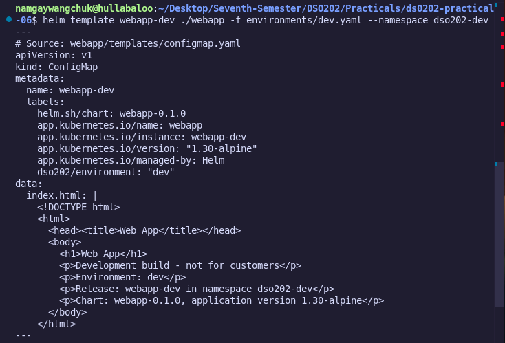

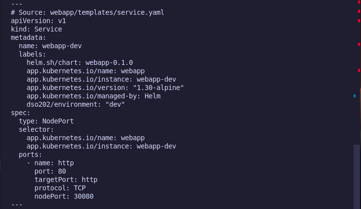

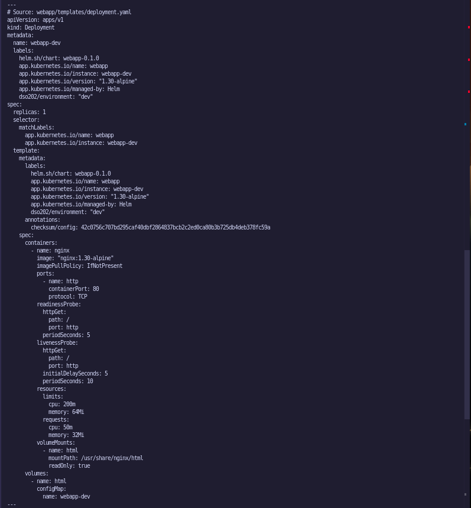

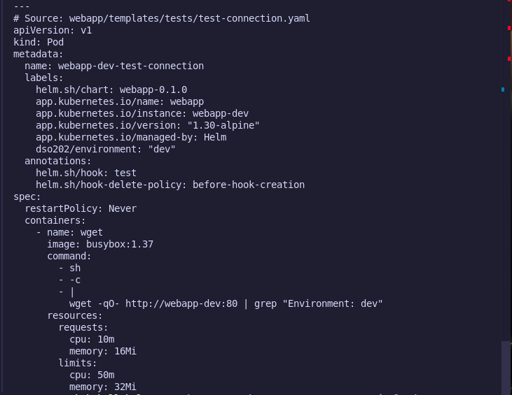

Filtering a single object using `--show-only` (`-s`)

```bash
helm template webapp-dev ./webapp -f environments/dev.yaml -n dso202-dev -s templates/configmap.yaml

```

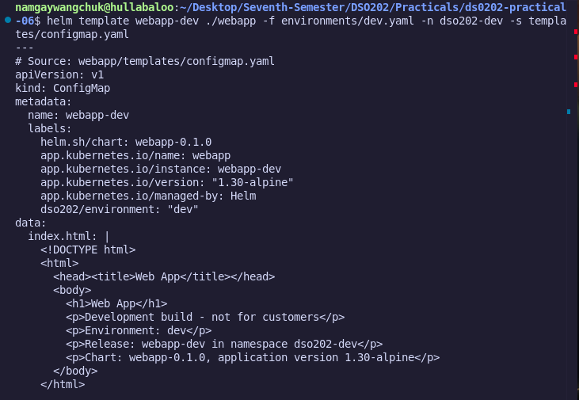

### Step 3: Custom Chart Deployment & Traffic Verification

To verify that the custom `webapp` chart deploys and serves traffic correctly before applying multi-environment overrides, deployed a test release into the `dso202-custom` namespace.

#### 1. Template Rendering & Lint Verification
Ran local template rendering with `--debug` and validated chart syntax using `helm lint`:

```bash
helm template my-app ./webapp --debug
helm lint ./webapp

```

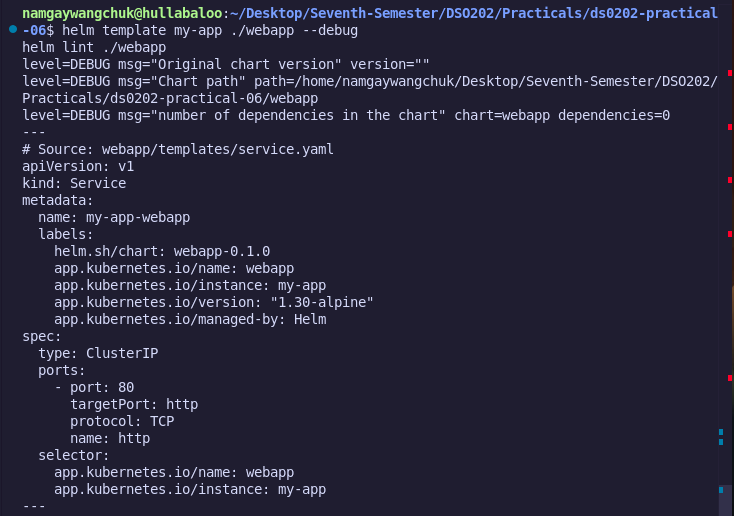

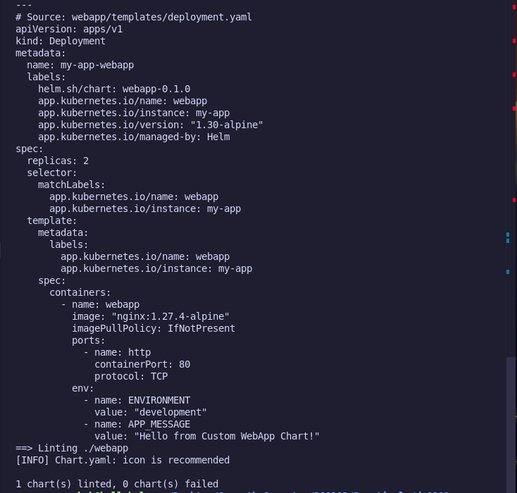

#### 2. Release Installation

Created the namespace and installed the initial custom release:

```bash
kubectl create namespace dso202-custom
helm install my-webapp ./webapp -n dso202-custom

```

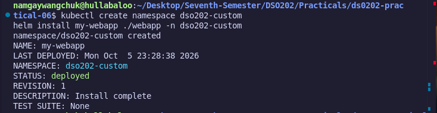

#### 3. Pod & Service Status Check

Verified that Helm registered the release as `deployed` and all pods transitioned to `Running` (2/2 ready):

```bash
helm list -n dso202-custom
kubectl get all -n dso202-custom

```

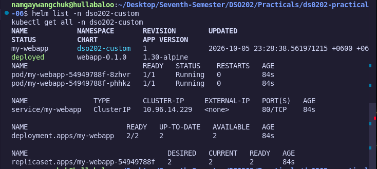

#### 4. Port Forwarding & Endpoint Testing

Port-forwarded port `8088` to port `80` of the deployment and tested HTTP response headers:

```bash
kubectl -n dso202-custom port-forward deploy/my-webapp 8088:80
curl -I http://localhost:8088

```

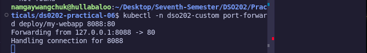

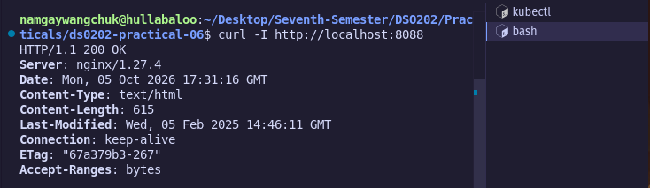

#### 5. Custom Namespace Cleanup

Uninstalled the test release and purged the temporary namespace:

```bash
helm uninstall my-webapp -n dso202-custom
kubectl delete ns dso202-custom

```

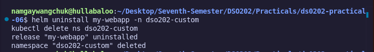

---

## Stage 4: Multi-Environment Configurations & Precedence

### Step 1: Creating Overrides

Created separate overrides outside the chart directory under `environments/`:

* **`environments/dev.yaml`**: Sets `replicaCount: 1`, `page.environment: dev`, and `service.type: NodePort` (port `30080`).
* **`environments/prod.yaml`**: Sets `replicaCount: 3`, `page.environment: prod`, and defines explicit CPU/Memory request and limit blocks.

### Step 2: Precedence & Merging Verification

The values seen by templates are the result of merging several sources in a fixed order of precedence. Where two sources set the same key, the later source wins:

$$\text{values.yaml (Default)} \longrightarrow \text{-f values1.yaml} \longrightarrow \text{-f values2.yaml} \longrightarrow \text{--set / --set-string}$$

#### Precedence & Merging Rules

* **Order of precedence (lowest first):**
1. Chart default `values.yaml`.
2. Files provided with `-f` or `--values` in command-line order (rightmost file wins).
3. Values specified via `--set`, `--set-string`, `--set-file`, `--set-json`, or `--set-literal` in command-line order (overrides every `-f` file regardless of command-line position).


* **How merging works:**
* **Deep Merging:** Maps are merged deeply key-by-key. Setting `page.environment` leaves `page.title` and `page.message` intact.
* **Complete Replacement:** Lists and scalars are completely replaced. Setting a list in a later file overwrites the entire list.
* **Key Deletion:** Setting a key to `null` deletes it entirely, including chart defaults.


---

### Step-by-Step Executions & Observations

#### 1. Command-Line Overrides (`--set`)

Overrode `replicaCount` from the command line on top of `environments/dev.yaml`

```bash
helm template webapp-dev ./webapp -f environments/dev.yaml --set replicaCount=2 -s templates/deployment.yaml | grep 'replicas:'

```

```text
replicas: 2

```

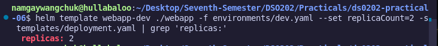

#### 2. Layering Environment Files & Deep Merging

Layered both environment files in both directions to observe key leakage caused by deep merging:

```bash
helm template webapp-dev ./webapp -f environments/dev.yaml -f environments/prod.yaml -s templates/service.yaml | grep -E 'type:|nodePort'
helm template webapp-dev ./webapp -f environments/dev.yaml -f environments/prod.yaml -s templates/deployment.yaml | grep -E 'replicas:|environment'

```

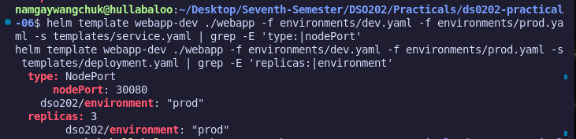


Reversing the order:

```bash
helm template webapp-dev ./webapp -f environments/prod.yaml -f environments/dev.yaml -s templates/deployment.yaml | grep -E 'replicas:|environment|cpu'

```

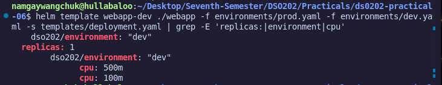


> **Observation:** Layering environment files is not "switching" environments. In the first execution, production retained development's `NodePort` setting (`30080`) because `prod.yaml` does not mention `service`. In the second execution, development retained production's CPU limits because `dev.yaml` does not mention `resources`. Each environment file must be applied on its own on top of chart defaults, or explicitly declare every key.

#### 3. Type Conversion & String Enforcement

Observed `--set` automatic type conversion producing unquoted booleans vs `--set-string` producing explicit string annotations

```bash
helm template webapp-dev ./webapp -f environments/dev.yaml -s templates/deployment.yaml \
  --set 'podAnnotations.prometheus\.io/scrape=true' | grep scrape
helm template webapp-dev ./webapp -f environments/dev.yaml -s templates/deployment.yaml \
  --set-string 'podAnnotations.prometheus\.io/scrape=true' | grep scrape

```

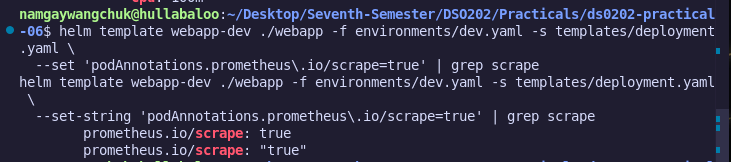


> **Observation:** `--set` converts `true` to a boolean value. While rendering without error locally, installing it against the API server fails because Kubernetes annotations strictly expect string values (`expected string, got &value.valueUnstructured{Value:true}`). `--set-string` forces string rendering (`"true"`) and resolves the failure.

#### 4. Deleting Defaults with `null`

Cleared a default value by setting `resources.limits` to `null`

```bash
helm template webapp-dev ./webapp -f environments/dev.yaml -s templates/deployment.yaml \
  --set resources.limits=null | sed -n '/resources:/,/volumeMounts/p'

```

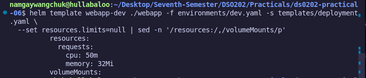

---

## Stage 5: Linting, Installation & Testing

### Step 1: Chart Linting & Local Rendering Verification

Checked chart validity and tested missing required value handling:

```bash
helm template webapp-dev ./webapp

```

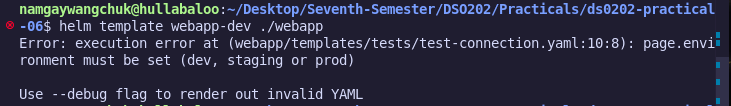

Running `helm lint` across values configurations:

```bash
helm lint ./webapp
helm lint --strict ./webapp

```

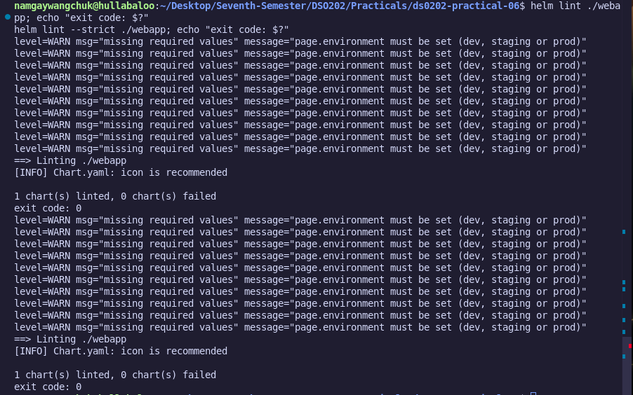

Testing YAML formatting and structural error detection:

```bash
helm template webapp-dev ./webapp -f environments/dev.yaml

```

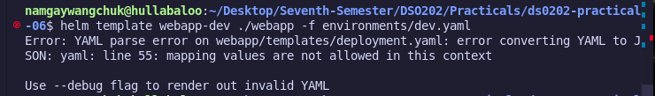

### Step 2: Value Type Conversions & Schema Validation

Simulating image tag floating point truncation and enforcing `values.schema.json` type constraints:

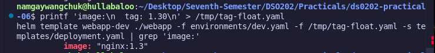


### Step 3: Dry-Run Server Validation & Release Loop

Simulating server-side dry-run deployment to catch strict K8s API schema errors (`spec.replica` vs `spec.replicas`):

```bash
helm install webapp-prod ./webapp -f environments/prod.yaml -n dso202-prod --create-namespace --dry-run=server

```

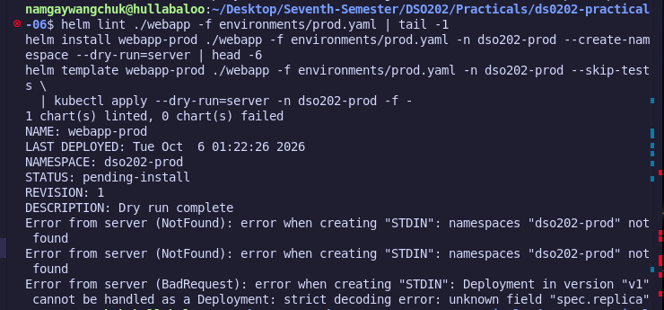

Running automated linting and template rendering loops for `dev` and `prod` targets:

```bash
for env in dev prod; do
  helm lint ./webapp -f environments/$env.yaml && \
  helm template webapp-$env ./webapp -f environments/$env.yaml > /dev/null && \
  echo "$env: ok"
done

```

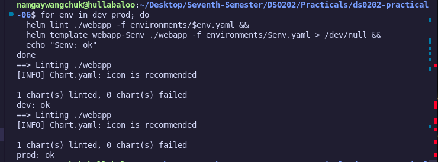

---

## Review Questions & Conceptual Analysis

### Stage 3 Review Questions

1. **Rewrite `{{ quote (upper .Values.name) }}` as a pipeline:**

$$\text{Pipeline Syntax: } \text{\{\{ .Values.name \vert{} upper \vert{} quote \}\}}$$


Data flows from left to right: `.Values.name` is passed into `upper`, and the resulting string is passed into `quote`.
2. **Inside `{{- range .Values.hosts }}`, explain why `{{ .Release.Name }}` fails and give the correct expression:**
* **Failure Reason:** The `range` action resets the root dot context (`.`) to the current iteration item inside `.Values.hosts`. Since `.Release` does not exist on the host item, it evaluates to `nil`.
* **Correct Expression:** `{{ $.Release.Name }}`. The `$` symbol always evaluates to the top-level root context regardless of loop scope.


3. **Explain why `include` rather than `template` is used for label blocks:**
The `template` action directly prints output and cannot be piped into functions. The `include` function returns the rendered string as a pipeline value, allowing it to be piped into `nindent` or `indent` to preserve exact YAML indentation.

### Stage 4 Review Questions

1. **Given `helm install r ./c --set a=1 -f x.yaml` where `x.yaml` sets `a: 2`, state the final value of `a` and explain why:**
* **Final Value:** `1`.
* **Reason:** `--set` flags have higher precedence than values files passed via `-f`.


2. **Explain why `-f dev.yaml -f prod.yaml` can produce a production release that exposes a NodePort:**
Helm deep-merges values files in left-to-right order. If `dev.yaml` sets `service.type: NodePort` and `prod.yaml` does not explicitly override `service.type` or set `service.nodePort: null`, the `NodePort` configurations inherited from `dev.yaml` persist.
3. **Give values that `--set` and a YAML file interpret differently:**
* **Booleans vs Strings:** `--set flag=true` converts to boolean `true`. To force a string in `--set`, `--set-string` must be used (`"true"`)
* **Version Numbers:** `--set version=1.30` treats the value as float `1.3`, dropping trailing zeros, whereas YAML wrapped in quotes (`"1.30"`) preserves string formatting.


### Stage 5 Review Questions

1. **Explain why `helm lint` succeeds for a chart that cannot be rendered with its default values:**
`helm lint` checks structural rules, metadata, and YAML validity using internal dummy defaults. If missing required template values (e.g., `required "page.environment must be set..."`) are only evaluated at template rendering time (`helm template`), the chart passes generic lint checks while failing rendering.
2. **JSON Schema fragment restricting `service.port` to 80 or 8080:**
```json
{
  "type": "object",
  "properties": {
    "service": {
      "type": "object",
      "properties": {
        "port": {
          "type": "integer",
          "enum": [80, 8080]
        }
      },
      "required": ["port"]
    }
  }
}

```


3. **Explain why a misspelled field is not caught by `helm template`:**
`helm template` performs client-side Go template processing and basic YAML parsing. It does not validate rendered fields against the Kubernetes API Server OpenAPI schema. A misspelled field (e.g., `spec.replica` instead of `spec.replicas`) is valid YAML syntax, so `helm template` succeeds. It is only caught when sent to the API server (e.g., via `kubectl apply --dry-run=server`), triggering a strict decoding error.

---

## Conclusion

This practical successfully demonstrated the full operational spectrum of Helm. Progressed from managing release lifecycles and performing state rollbacks to authoring production-grade custom charts equipped with helper pipelines, multi-environment overrides, schema validation rules, and automated testing hooks.