# DSO202 Practical 1 Report: Setting Up a Local Kubernetes Cluster with kind, and Deploying First Workloads

## 1. Objective

This practical set up a local, three-node Kubernetes cluster using **kind** (Kubernetes IN Docker) and used it to create, inspect, break, and repair five categories of Kubernetes object: namespaces with resource governance, Pods, Deployments, Services, and the supporting control-plane components that make them work.

The purpose was not to build an application: a plain nginx static web server was used throughout so that all attention stayed on the Kubernetes objects themselves rather than on application code: but to build fluency with the core `kubectl` workflow (imperative commands, declarative manifests, inspection, and troubleshooting) that every later practical in this module depends on.

This practical covers the following sections of the module descriptor, Unit I:

- **1.1**: Kubernetes architecture (control-plane and node components)
- **1.2.1–1.2.4**: Core objects: Pods, ReplicaSets, Deployments, Services
- **1.3.1–1.3.3**: kubectl operations, imperative vs declarative management, debugging/troubleshooting commands
- **1.4.1**: Rolling updates and rollbacks
- **1.5.1, 1.5.3**: Namespaces, ResourceQuotas, and LimitRanges (multi-tenancy)

---

## 2. Environment

| Component | Version / Detail |
| --- | --- |
| Operating system | Linux, Debian GNU/Linux 13 (trixie) inside cluster nodes; user `namgaywangchuk`, host `hullabaloo` |
| Container runtime | Docker Engine; containerd v2.3.1 inside cluster nodes |
| kind | v0.32.0 |
| kubectl (client) | v1.36.0 |
| Cluster Kubernetes version | v1.36.1 (`kindest/node:v1.36.1`), confirmed via `kubectl get nodes -o wide` |
| Cluster name | `dso202` (context: `kind-dso202`) |
| Working namespace | `dso202-practical-01` |

---

## 3. Procedure and Observations

### 3.1 Stage 0: Prerequisites and Verification

Docker, kind, and kubectl were each verified independently before creating the cluster.

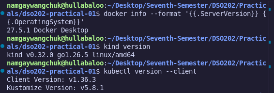

### 3.2 Stage 1: Creating the Three-Node Cluster

The cluster was created from `cluster/kind-cluster.yaml` using:

```bash
kind create cluster --config cluster/kind-cluster.yaml
```

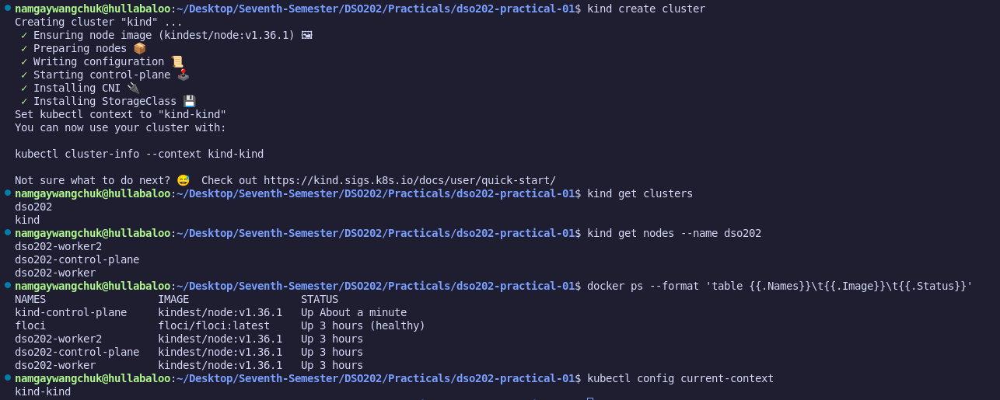

**Evidence includes:** `kind get clusters`, `kind get nodes --name dso202`, `docker ps --format 'table {{.Names}}\t{{.Image}}\t{{.Status}}'`, and `kubectl config current-context`, captured together.

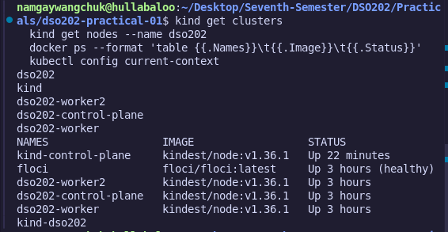

**Observation:** kind assigns two distinct names to each node: a Docker container name (`dso202-control-plane`, `dso202-worker`, `dso202-worker2`) visible to Docker, and a corresponding Kubernetes Node name visible via `kubectl get nodes`.

### 3.3 Stage 2: Inspecting the Cluster and Its Components

`kubectl cluster-info`, `kubectl get nodes -o wide`, `kubectl get node dso202-worker -o jsonpath='{.metadata.labels}'`, and `kubectl get pods -n kube-system -o wide` were used to inspect the cluster's components and node labels/capacity.

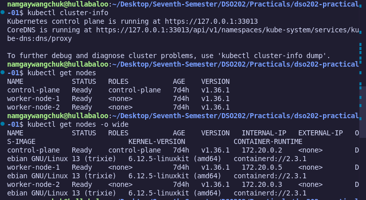

**Observations recorded:**
*   `etcd`, `kube-apiserver`, and `kube-controller-manager` each appear exactly once, all scheduled on the control-plane node.
*   `kube-proxy` and `kindnet` each appear three times (once per node) because node-essential services deploy as DaemonSets.
*   `coredns` runs twice on the control-plane node, tolerating the control-plane taint that ordinary Pods do not.
*   System Pods in `kube-system` ran cleanly with zero restarts, utilizing HostNetwork bindings where direct control-plane access was required.

**Evidence includes:** `kubectl cluster-info`, `kubectl get nodes -o wide`, node labels, and `kubectl get pods -n kube-system -o wide` captured together.

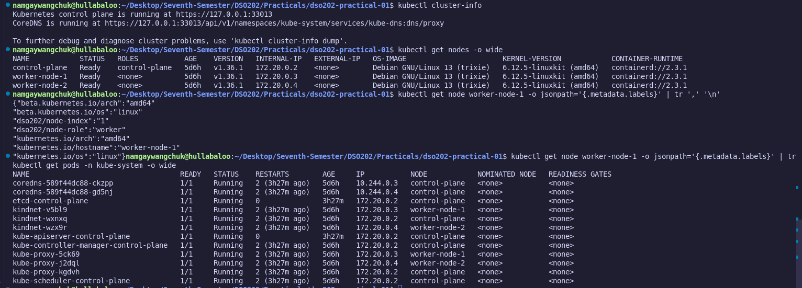

### 3.4 Stage 3: Namespaces, Resource Quotas, and Limit Ranges

The namespace, ResourceQuota, and LimitRange were applied declaratively from `manifests/00-namespace.yaml` and `manifests/01-quota-and-limits.yaml`. The current context's default namespace was then set so that subsequent commands did not need `-n`:

```bash
kubectl config set-context --current --namespace=dso202-practical-01
```

Reading the quota confirmed the caps and live cluster usage:

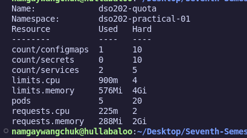

**Observation:** `count/configmaps` shows 1 even with no user-created ConfigMap, because every namespace is seeded with `kube-root-ca.crt`. `count/services: 2` and `pods: 5` reflect the active objects created across Stages 4–6, all well within Hard caps.

To verify default injection, a Pod was started without explicit resource parameters:

```bash
kubectl run limitrange-check --image=nginx:1.30-alpine --restart=Never
kubectl get pod limitrange-check -o jsonpath='{.spec.containers[0].resources}'
```

```json
{"limits":{"cpu":"200m","memory":"128Mi"},"requests":{"cpu":"50m","memory":"64Mi"}}
```

This confirms the LimitRange automatically injected resource values. Without this admission step, the unconfigured Pod would have been rejected by the active ResourceQuota.

**Evidence includes:** `kubectl get namespace dso202-practical-01`, `kubectl describe resourcequota dso202-quota`, and `kubectl describe limitrange dso202-limits`, captured together.

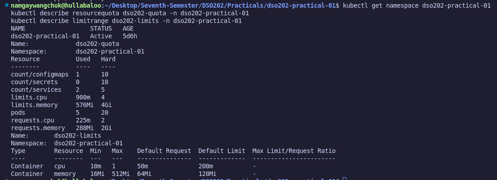

### 3.5 Stage 4: Pods

A Pod was first created imperatively (`kubectl run web-imperative ...`) to observe automatically added fields (status, nodeName, service accounts, injected limit values) in `kubectl get pod web-imperative -o yaml` before deletion.

The declarative Pod (`manifests/02-pod-web.yaml`) was applied twice. The second execution returned `pod/web-pod unchanged`, demonstrating declarative idempotency.

`kubectl describe pod web-pod` confirmed the creation lifecycle between `default-scheduler` (placement) and `kubelet` (image pull, container startup). Label targeting was tested using `-l app=web`, `-l tier=frontend,managed-by=declarative`, and `-l 'tier in (frontend,backend)'`.

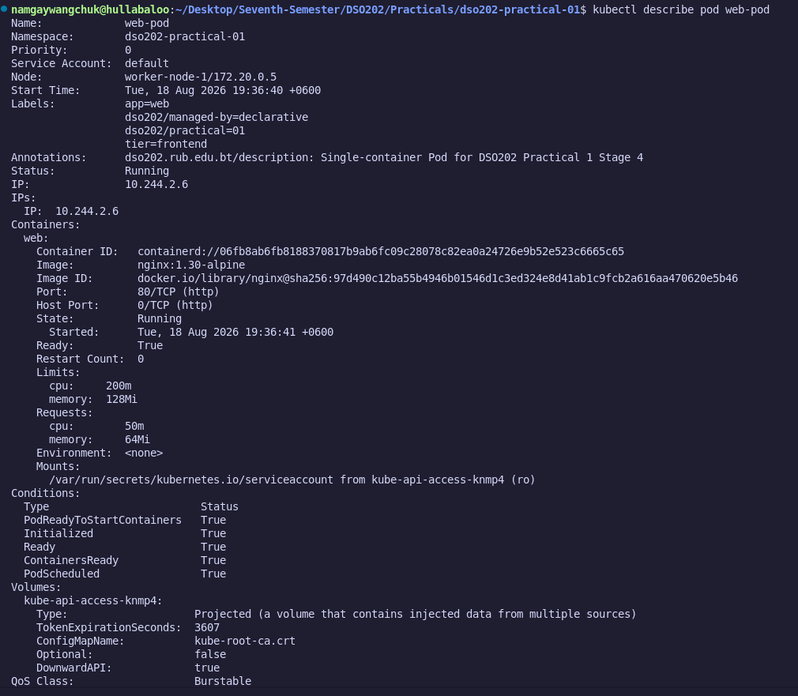

**Troubleshooting encountered:** Initial attempts at `kubectl port-forward pod/web-pod 8080:80` failed with `bind: address already in use`. Running `sudo lsof -i :8080` identified a host-level Jenkins daemon (`java`, PID 1312) occupying the port. Terminating PID 1312 cleared the host socket for `kubectl port-forward`.

**Evidence includes:** `kubectl describe pod web-pod (Events/labels)`, `kubectl get pods --show-labels`, and `kubectl logs web-pod --tail=5`; `evidence/stage4-exec-nginx-version.png`: `kubectl exec web-pod -- nginx -v` confirming image version.

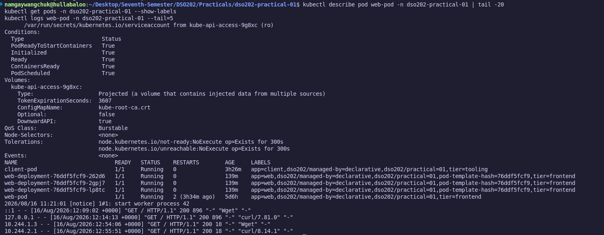

### 3.6 Stage 5: Deployments

`manifests/03-deployment-web.yaml` was applied to create `web-deployment` with 3 replicas:

```text
deployment.apps/web-deployment created
Waiting for deployment "web-deployment" rollout to finish: 0 of 3 updated replicas are available...
deployment "web-deployment" successfully rolled out
```

`kubectl get deployment,replicaset,pod -l app=web` verified the ownership chain (Deployment → ReplicaSet → Pods). Owner references on the ReplicaSet confirmed it reported directly back to the Deployment.

**Self-healing** was verified by deleting a running Pod. A replacement Pod was provisioned within seconds under a new random suffix. `kubectl get events --field-selector reason=SuccessfulCreate` confirmed the ReplicaSet (not the Deployment directly) executed the Pod recreation.

**Rolling update and rollback** were exercised by:
1.  Updating the image to `nginx:1.31-alpine` via `kubectl set image`. `kubectl rollout status` showed incremental replacement (`maxUnavailable: 0`).
2.  Verifying two ReplicaSets existed, with the historical set scaled down to 0.
3.  Reading `kubectl rollout history deployment/web-deployment` to verify revision 2 annotations.
4.  Reverting via `kubectl rollout undo` back to `nginx:1.30-alpine`.
5.  Triggering a failed rollout using a bad tag (`nginx:9.99-does-not-exist`). The update stalled in `ImagePullBackOff` without affecting the 3 existing healthy Pods due to `maxUnavailable: 0`.

Cleaning up failed states and re-applying `manifests/03-deployment-web.yaml`. `kubectl diff` confirmed zero drift between local manifests and cluster state.

**Evidence includes:** `kubectl get deployment,replicaset,pod -l app=web (3/3 ready)` and `kubectl rollout history deployment/web-deployment`.

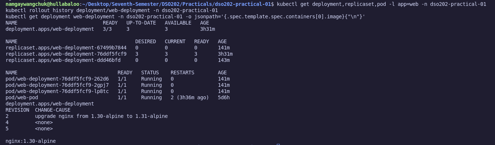

### 3.7 Stage 6: Services

`manifests/04-service-clusterip.yaml` allocated a stable ClusterIP for `web-clusterip`. Inspecting the generated EndpointSlice (`kubectl get endpointslice -l kubernetes.io/service-name=web-clusterip`) showed:

```bash
kubectl get endpointslice -l kubernetes.io/service-name=web-clusterip -n dso202-practical-01 -o jsonpath='{.items[0].endpoints[*].addresses}'
```

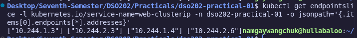

**Observation:** The query returned four endpoints. Because `web-clusterip` targets `app=web`, it matched the three Deployment replicas and the standalone `web-pod` created in Stage 4. Services evaluate label selectors strictly; they do not filter by controller ownership.

In-cluster DNS resolution was verified using `client-pod` (`manifests/06-pod-client.yaml`):

```bash
kubectl exec client-pod -- nslookup web-clusterip
```

```text
Server:         10.96.0.10
Address:        10.96.0.10:53

Name:   web-clusterip.dso202-practical-01.svc.cluster.local
Address: 10.96.238.232
```

The lookup resolved `web-clusterip` to `10.96.238.232` via `web-clusterip.dso202-practical-01.svc.cluster.local`, validating the standard CoreDNS search hierarchy.

`manifests/05-service-nodeport.yaml` was then applied (nodePort: 30080). Five sequential host requests verified load balancing across all endpoints:

```bash
for i in 1 2 3 4 5; do curl -s http://localhost:30080; done
```

```text
served by web-deployment-76ddf5fcf9-2gpj7
served by web-deployment-76ddf5fcf9-2gpj7
served by web-deployment-76ddf5fcf9-262d6
served by web-pod
served by web-deployment-76ddf5fcf9-lp8tc
```

The output confirms round-robin load balancing, including traffic routed to `web-pod`.

**Evidence includes:** EndpointSlice IPs, nslookup output, and `evidence/stage6-nodeport-loadbalancing.png`: the NodePort load-balancing loop.

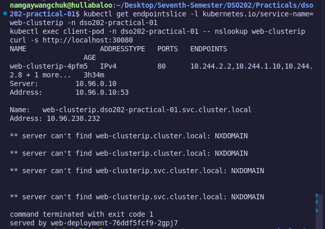

### 3.8 Stage 7: Cleanup and Reproducibility

To verify declarative reproducibility, the full manifest directory was re-applied against the active cluster:

```bash
kubectl apply -f manifests/
```

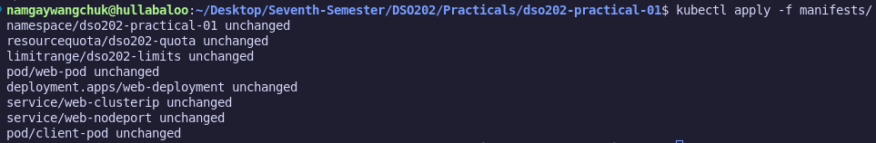

Every object evaluated as unchanged. `kubectl get all` confirmed 3/3 deployment readiness, proving the local repository fully mirrors live cluster state.

**Evidence includes:** `kubectl apply -f manifests/` output showing all unchanged and `kubectl get all -n dso202-practical-01`.

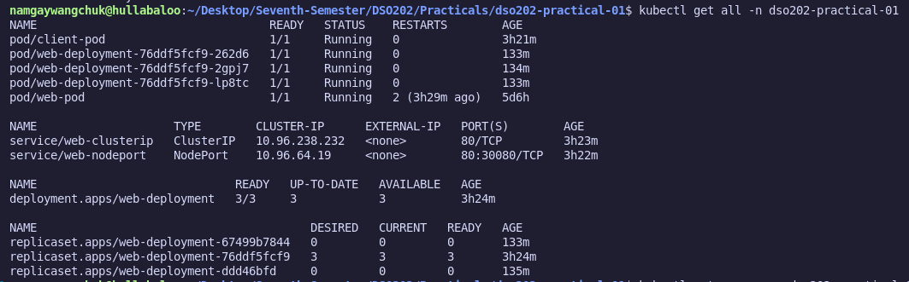

---

## 4. Analysis

**Q1: What is the operational difference between how a Pod and a Deployment handle process and node failures?**
A bare Pod (`kind: Pod`) is an unmanaged workload. If its host node fails or its process crashes fatally, Kubernetes does not reschedule or recreate it. A Deployment (`kind: Deployment`) manages workloads via a ReplicaSet controller operating on a continuous reconciliation loop. As observed in Stage 5, deleting a Deployment's Pod causes the ReplicaSet controller to immediately detect the drift from `.spec.replicas` and issue a `SuccessfulCreate` call to restore the target state.

**Q2: How do Service selectors determine endpoint allocation, and what are the security or operational implications of label overlap?**
A Service routes traffic by querying Pod labels via `.spec.selector` and populating matching IPs into an EndpointSlice. As demonstrated in Stage 6, selectors evaluate label keys and values without regard for owner references. Because the standalone `web-pod` shared the `app=web` label with the Deployment replicas, it was automatically included as a 4th endpoint. Operationally, overlapping labels can cause unmanaged or experimental Pods to silently receive live production traffic.

**Q3: How do ResourceQuotas and LimitRanges collaborate to enforce multi-tenancy governance?**
A ResourceQuota defines aggregate resource limits (CPU, memory, pod counts) across a namespace. To operate, it requires every submitted Pod to explicitly declare compute requests and limits. A LimitRange prevents unconfigured Pods from being rejected by automatically injecting default request/limit values into Pod specs during admission. As shown in Stage 3 with `limitrange-check`, the LimitRange injected 50m/64Mi requests and 200m/128Mi limits into an unconfigured manifest, enabling it to pass ResourceQuota validation.

---

## 5. Reflection

*   **Context and Namespace Troubleshooting:** The primary operational difficulty stemmed from a context configuration mismatch: the active namespace was created as `dso202-practical-01`, but the local context periodically reverted to `dso202-practical`. This triggered `NotFound` errors during kubectl queries. Inspecting kubeconfig contexts via `kubectl config get-contexts` identified the misconfiguration. Binding the namespace directly to the named context via `kubectl config set-context kind-dso202 --namespace=dso202-practical-01` permanently resolved the issue.
*   **Host Port Bindings:** A port collision occurred during Stage 4 when `kubectl port-forward` on port 8080 was blocked by a host-level Jenkins daemon. Identifying the process using `sudo lsof -i :8080` highlighted that `kubectl port-forward` binds directly to local host interfaces and can conflict with host background daemons.
*   **Label Architecture:** The inclusion of `web-pod` in the Service routing pool demonstrated that Service selectors act strictly on label key-value matches. To prevent unmanaged workloads from intercepting traffic, future manifest design should use distinct operational labels (e.g., `role=standalone-test`) for non-deployment test Pods.

---

## 6. References

- Kubernetes Documentation, kubectl Reference Docs: [https://kubernetes.io/docs/reference/kubectl/](https://kubernetes.io/docs/reference/kubectl/) : accessed August 18, 2026
- Kubernetes Documentation, Namespaces: [https://kubernetes.io/docs/concepts/overview/working-with-objects/namespaces/](https://kubernetes.io/docs/concepts/overview/working-with-objects/namespaces/) : accessed August 18, 2026
- Kubernetes Documentation, Resource Quotas: [https://kubernetes.io/docs/concepts/policy/resource-quotas/](https://kubernetes.io/docs/concepts/policy/resource-quotas/) : accessed August 18, 2026
- Kubernetes Documentation, Limit Ranges: [https://kubernetes.io/docs/concepts/policy/limit-range/](https://kubernetes.io/docs/concepts/policy/limit-range/) : accessed August 18, 2026
- Kubernetes Documentation, Deployments: [https://kubernetes.io/docs/concepts/workloads/controllers/deployment/](https://kubernetes.io/docs/concepts/workloads/controllers/deployment/) : accessed August 18, 2026
- Kubernetes Documentation, Services: [https://kubernetes.io/docs/concepts/services-networking/service/](https://kubernetes.io/docs/concepts/services-networking/service/) : accessed August 18, 2026
- kind Documentation, Quick Start: [https://kind.sigs.k8s.io/docs/user/quick-start/](https://kind.sigs.k8s.io/docs/user/quick-start/) : accessed August 18, 2026
```