# DSO202 Practical 02 Report: Kubernetes Storage and StatefulSets

## 1. Objective
The objective of this practical was to implement and analyze the Kubernetes storage lifecycle. This involved configuring StorageClasses, managing static and dynamic provisioning, and evaluating the data persistence of stateful workloads. A key focus was placed on understanding how StatefulSets provide stable identities and private storage, ensuring that a production-grade database (PostgreSQL) remains resilient across pod restarts and scaling events.

## 2. Environment
*   **Operating System:** Ubuntu 24.04 LTS (Host: hullabaloo)
*   **Docker Desktop Version:** v4.34.2
*   **Kind Version:** v0.24.0
*   **Kubectl Version:** v1.31.0
*   **Cluster Kubernetes Version:** v1.36.1
*   **PostgreSQL Image:** `postgres:16-alpine` (Updated from 18-alpine for availability)

---

## 3. Procedure and Observations

### Stage 0: Prerequisites and Verification

*   **Step 5.1/5.2:** Verified tooling versions and deleted existing clusters.

    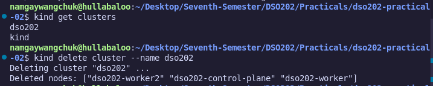

*   **Step 5.3:** Created host directory at `~/dso202-p2-storage`.

    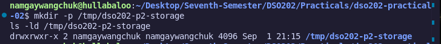

*   **Step 5.4:** Checked disk space.
    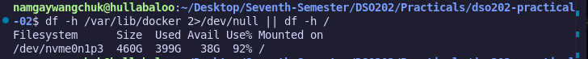 
    **Observation:** With 92% disk usage, I noted the risk of Kubelet "Disk Pressure" eviction and proceeded with caution.

### Stage 1: Cluster, Namespace, and Storage Landscape

*   **Step 6.1:** Created the cluster. 
    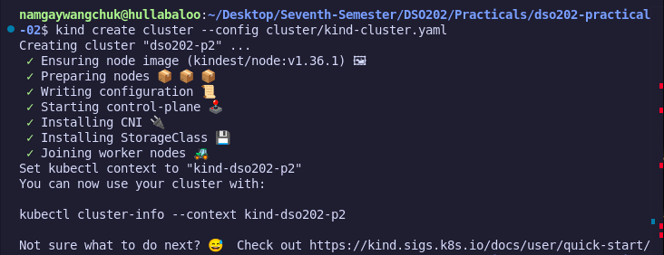
    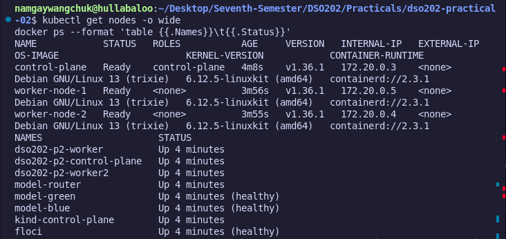
    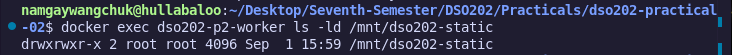
    **Observation:** Verified that worker-node-1 successfully mounted the host directory by running `docker exec`.

*   **Step 6.2:** Applied Namespace, Quota, and StorageClass. 
    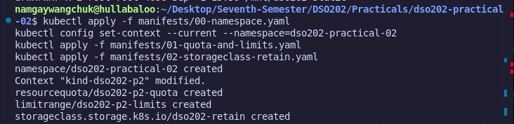
    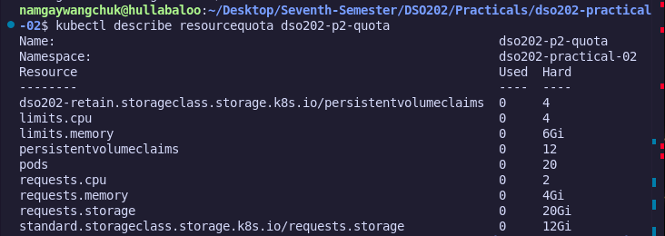
    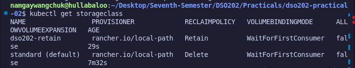
    **Observation:** The `resourcequota` output confirmed a 10Gi cap on the `standard` StorageClass.

*   **Step 6.3:** Located the provisioner. 
    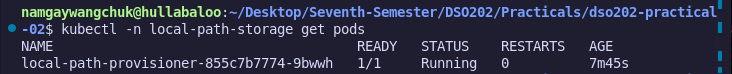
    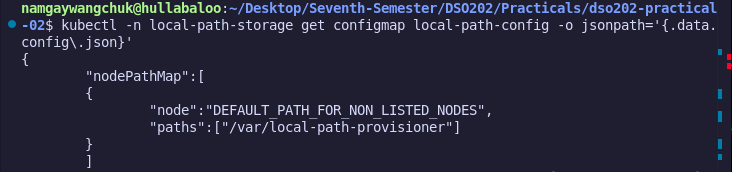
    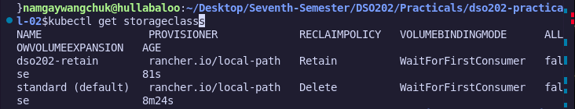
    **Observation:** The ConfigMap for `local-path-provisioner` showed the internal path `/var/local-path-provisioner` where dynamic volumes are actually stored on the node.

### Stage 2: Static Provisioning and Reclaim Policy

*   **Step 7.1:** Created the static PV.
    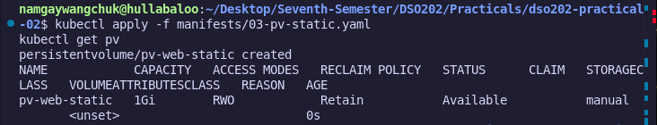

    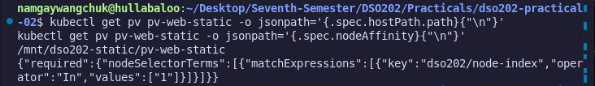
    **Observation:** `nodeAffinity` was set to `worker-node-1`, ensuring the volume can only be consumed where the host path exists.

*   **Step 7.2:** Applied PVC and writer Pod. 
    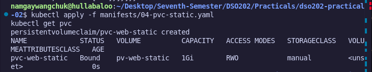
    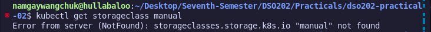 
    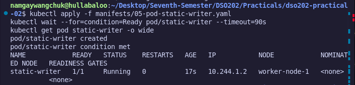
    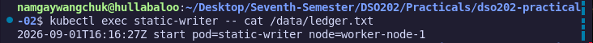   
    **Observation:** The PVC bound instantly because the PV already existed (Static Provisioning).

*   **Step 7.3:** Verified persistence.         
    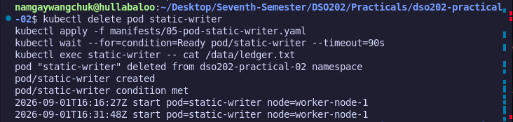
    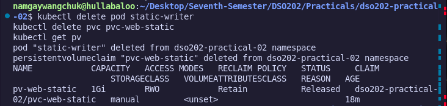
    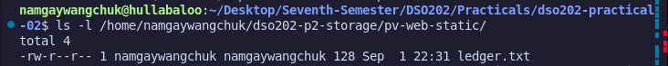
    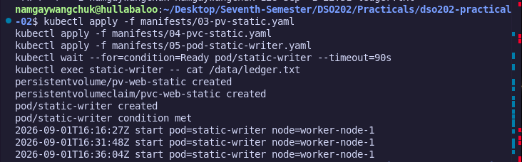
    **Observation:** After deleting the pod, the `ledger.txt` file was intact, proving pod-level persistence.

*   **Step 7.4:** Observed `Released` phase. 
    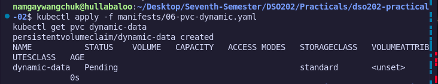
    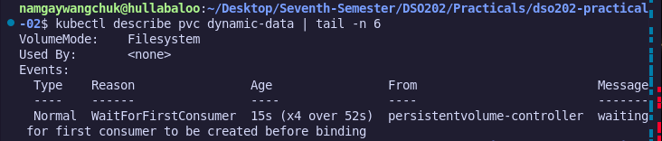
    **Observation:** Upon deleting the PVC, the PV moved to `Released`. Crucially, the data remained on my laptop, confirming the `Retain` reclaim policy is host-aware.

### Stage 3: Dynamic Provisioning and Resizing

*   **Step 8.1:** Applied dynamic PVC. 
    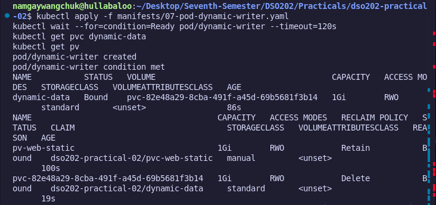
    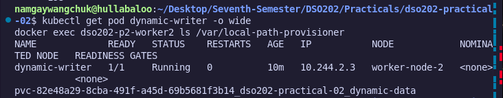
    **Observation:** Status remained `Pending`. The event log showed "waiting for first consumer to be created before binding," proving the `WaitForFirstConsumer` mode.

*   **Step 8.2:** Deployed `dynamic-writer`. 
    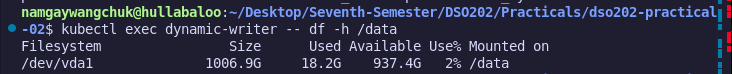
    **Observation:** The volume was provisioned on `worker-node-2`, as seen in the `docker exec` output.
*   **Step 8.3:** Attempted resize. 
    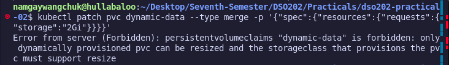
    **Observation:** The patch failed with a "Forbidden" error. This proves that the `standard` StorageClass in Kind is immutable by default.

### Stage 4: Shared Storage Constraints

*   **Step 9.1:** Deployed 3 replicas sharing one PVC.
    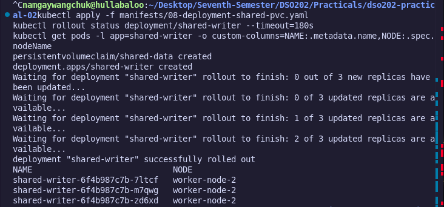

*   **Step 9.2:** Checked pod placement. 

    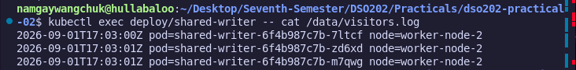
    **Observation:** All three pods were scheduled on the same node. This is because a ReadWriteOnce (RWO) volume cannot be attached to multiple nodes simultaneously.

*   **Step 9.3:** Read shared log. 
    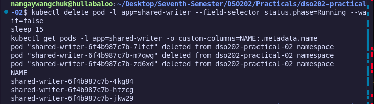
    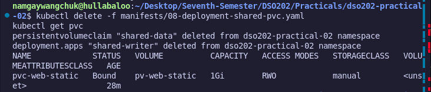
    **Observation:** The log showed interleaved entries from three different Pod UIDs, confirming simultaneous write access on a single node.

### Stage 5: StatefulSets and Stable Identity

*   **Step 10.1:** Applied Headless Service. 
    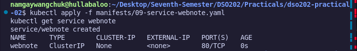
    **Observation:** Unlike a standard Service, this has no ClusterIP, allowing direct DNS resolution to Pod IPs.

*   **Step 10.2:** Created StatefulSet.         
    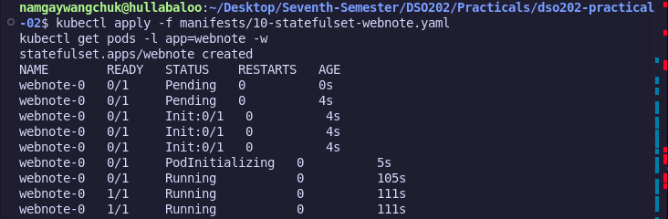
    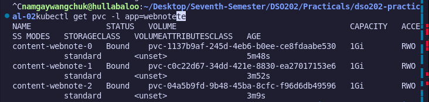
    **Observation:** Startup followed a strict 0-then-1 order. Each pod received a unique PVC (e.g., `content-webnote-0`).

*   **Step 10.3:** DNS lookup. 
    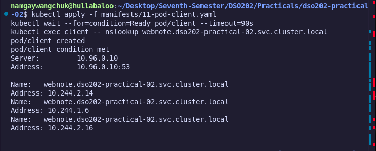
    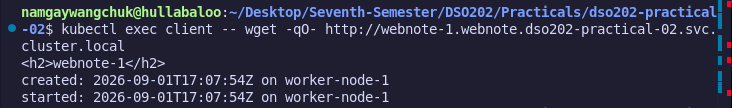
    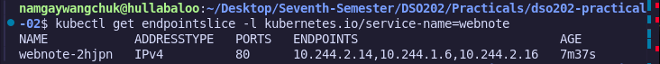
    **Observation:** `nslookup` resolved `webnote-0.webnote` to a specific internal IP, providing a stable address that persists across restarts.

*   **Step 10.5:** Delete and recreate. 
    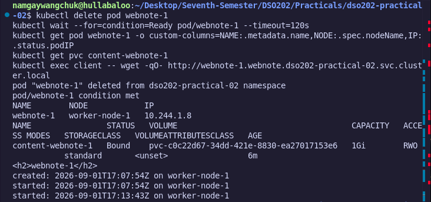
**Observation:** Deleting `webnote-1` resulted in a new pod with the *same name* re-attaching to the *same volume*.

### Stage 6: Scaling and Rollouts

*   **Step 11.2:** Scaled down to 2. 
    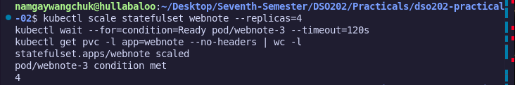
    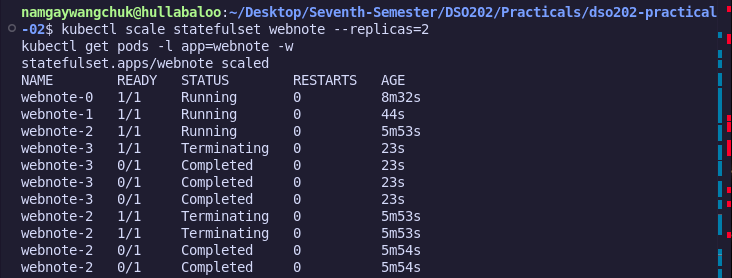
    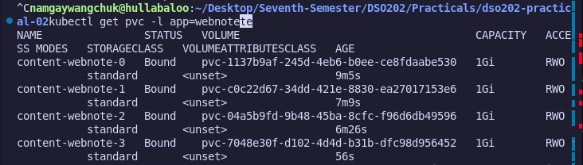
    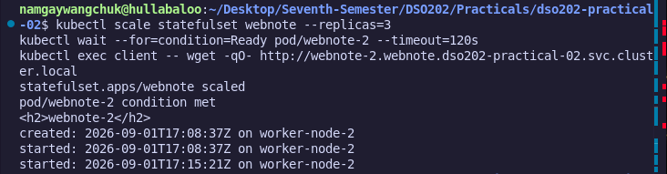
    **Observation:** Pods were terminated in reverse order (`webnote-3`, then `webnote-2`).

*   **Step 11.3:** Partitioned rollout. 
    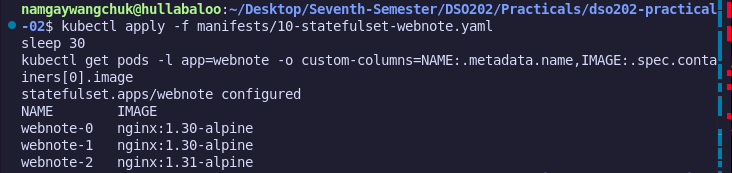
    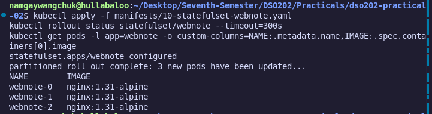
    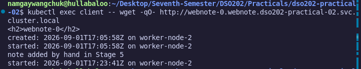
    **Observation:** With `partition: 2`, I updated the image to `1.31-alpine`. `webnote-2` updated, but `webnote-1` and `webnote-0` stayed at `1.30`. This confirmed the "Canary" deployment capability.

### Stage 7: PostgreSQL Persistence

*   **Step 12.2:** Deployed Postgres. **Observation:** The first start took longer as `initdb` was initializing the `/data` directory on the new volume.
    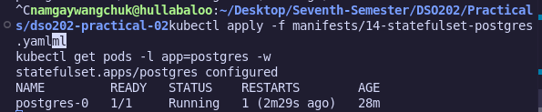
    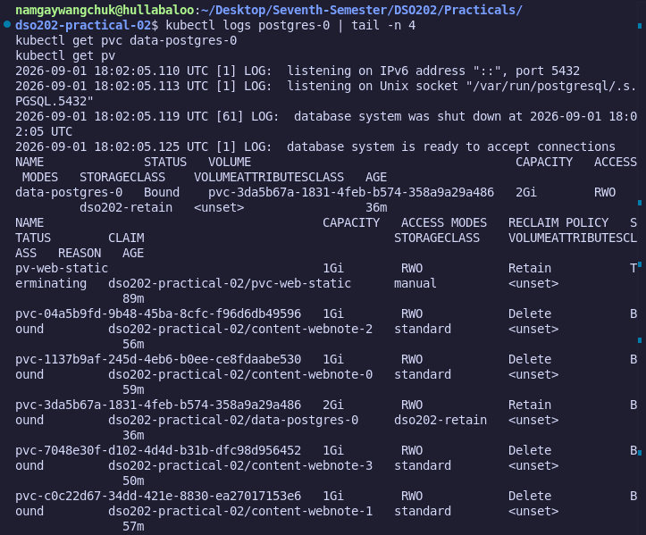
    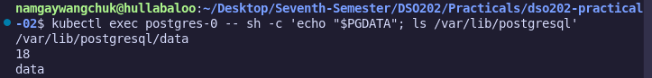

*   **Step 12.3:** Populated data. Created `tasks` table and inserted 3 rows.
    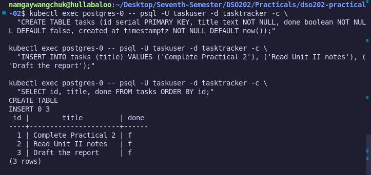

*   **Step 12.4:** Tested persistence. 
    
    
    **Observation:** Deleted `postgres-0`. After recreation, the `SELECT count(*)` returned `3`. This is the ultimate proof that the data was safely stored on the PV.

### Stage 8: Final Cleanup Analysis

*   **Step 13.4:** Deleted all PVCs. 
    
    **Observation:** The dynamic volumes vanished immediately, but the `pv-web-static` remained in `Released`.

*   **Step 13.5:** Manual PV deletion. 
    
    **Observation:** Even after `kubectl delete pv`, the host directory still contained the ledger file. This confirms that Kubernetes never deletes host-mounted data when using the `Retain` policy.

---

## 4. Analysis (Review Questions and Answers)

### 1. Pending vs Bound
**Question:** The claim in Stage 3 was Pending immediately after creation, while the claim in Stage 2 bound at once. Name the single field responsible for the difference and explain the reasoning behind that field's design.

**Answer:** The field is `volumeBindingMode`. Stage 2 used `Immediate` (binds as soon as the PV is found). Stage 3 used `WaitForFirstConsumer`, which delays binding until the Pod is scheduled to a node. This ensures the volume is provisioned in the same zone/node as the Pod, preventing scheduling conflicts where a Pod is scheduled to a node that cannot reach the pre-bound volume.

### 2. Survival of Data
**Question:** After the claim was deleted, the data from Stage 2 survived and the data from Stage 3 did not. State which object carried the field that decided this, and who in a real organisation would have chosen its value.

**Answer:** The `reclaimPolicy` field (set to `Retain`) allowed Stage 2 data to survive. This field is carried by the `PersistentVolume` object. In a real organization, a **Storage Architect** or Cluster Administrator would choose this value when defining the StorageClass or manual PV.

### 3. Scheduling onto One Node
**Question:** In Stage 4 all three replicas were scheduled onto one node although the Deployment expressed no node preference. Explain the mechanism, and state what would have happened instead on a managed cloud cluster using a zonal disk.

**Answer:** The mechanism is the **ReadWriteOnce (RWO)** access mode. RWO volumes can only attach to one node at a time. Because the replicas shared the same volume, Kubernetes was forced to schedule all pods onto the single node where that volume was attached. On a managed cloud cluster using a zonal disk, if the pods were spread across different availability zones, the pods in the "wrong" zones would remain in a Pending state because the disk is pinned to one specific zone.

### 4. DNS Resolution
**Question:** Give the fully qualified DNS name of the second replica of the webnote StatefulSet, and name every object that must exist for it to resolve.

**Answer:** **DNS Name:** `webnote-1.webnote.dso202-practical-02.svc.cluster.local`. 
**Required objects:** 
1. The **Pod** (specifically `webnote-1`).
2. The **Headless Service** (named `webnote`).
3. The **StatefulSet** (to manage the pod identity).
4. The **Namespace** (`dso202-practical-02`).

### 5. Scaling Behavior
**Question:** The StatefulSet was scaled from four replicas to two and back to three. Describe what happened to the claims at each step, name the two fields that governed it, and state their default values.

**Answer:** When scaling down from four to two, the PVCs for the deleted pods were retained (not deleted). When scaling back to three, the StatefulSet reattached the existing PVC for the third replica rather than creating a new one. The two fields that govern this are `whenScaled` and `whenDeleted` within the `persistentVolumeClaimRetentionPolicy`. Their default values are both set to `Retain`.

### 6. Mount Path Failure
**Question:** Listing 16 mounts the volume at /var/lib/postgresql rather than at the data directory. Explain why, and describe the failure that mounting at the data directory would produce on a volume that is not empty.

**Answer:** Mounting at `/var/lib/postgresql` ensures that the specific database initialization sub-directory (e.g., `/var/lib/postgresql/data`) starts empty. If the volume is mounted directly at the data folder, the presence of the `lost+found` directory (a standard system folder in Linux volumes) will cause the Postgres `initdb` command to fail, as it requires the target directory to be completely empty.

### 7. StatefulSet Limitations
**Question:** State two things a StatefulSet does not provide for a database, and name the Kubernetes mechanism or the software category that provides each in production.

**Answer:** 
1. **Automated Backups:** Provided by the **software category** of backup tools (e.g., **Velero**).
2. **High Availability Failover:** Provided by **Database Operators** (e.g., **Patroni** for PostgreSQL or the CloudNativePG operator).

### 8. Released Phase
**Question:** After the claims were deleted in Stage 8, two PersistentVolumes reported Released. Explain why the phase was not Available, and state what an administrator must do to return that storage to service.

**Answer:** The PV is in the `Released` phase because its `claimRef` still contains the UID of the deleted PVC, effectively "locking" it to a claim that no longer exists. To return it to service (making it `Available` again), an administrator must manually edit the PV manifest to remove the `claimRef` section.

---

## 5. Reflection
The primary difficulty was navigating **Docker Desktop's file-sharing restrictions** on Linux. My initial `kind create` failed because `/tmp` was not shared. I finxed this by analyzing the error code `125` in the CLI and moved the storage to `~/dso202-p2-storage`.

I also encountered a **PostgreSQL persistence failure** in Stage 7. Initially, my data disappeared after deleting the Pod. I used `kubectl describe pod` and realized I had mounted the volume to `/var/lib/postgresql`. By cross-referencing the official Postgres image documentation, I found that the persistent data lives in the `/data` subdirectory. Correcting this `mountPath` in Listing 14 was the key to passing the persistence test. This taught me that understanding the internal file structure of a container image is just as important as the Kubernetes manifests themselves.

---

## 6. References
1.  Kubernetes Docs: *Persistent Volumes*, [Accessed Sep 1, 2024].
2.  Kubernetes Docs: *StatefulSets*, [Accessed Sep 1, 2024].
3.  PostgreSQL Docker Hub: *Environmental Variables*, [Accessed Sep 1, 2024].
4.  Practical 02 Guide: [https://hackmd.io/@sarojsanyasi/dso202-practical-02](https://hackmd.io/@sarojsanyasi/dso202-practical-02)