# Environment-Specific Configuration with Kustomize on Kind
## A Practical Report

> **Heads Up:** No starter repository was located for this practical, so the entire `examples/webapp` tree; the shared `base/` (Deployment, Service, `index.html`, `kustomization.yaml`) and the `dev` / `staging` / `prod` overlays was created from scratch to satisfy the guide's requirements, in addition to the `qa` overlay explicitly required by Task 9 and the `sandbox` overlay used for the Challenge extension. Every manifest was first validated with `kustomize build` before being applied to the live cluster, and the cluster evidence throughout this report is real output captured from that live run.

---

## Table of Contents

1. [What is Kustomize? (Concept)](#1-what-is-kustomize-concept)
2. [Pre-flight and Repository Structure](#2-pre-flight-and-repository-structure-tasks-0-1)
3. [Rendering the Base](#3-rendering-the-base-task-2)
4. [Comparing Dev vs Prod Offline](#4-comparing-dev-vs-prod-offline-task-3)
5. [Deploying Dev](#5-deploying-dev-task-4)
6. [Reaching the Application](#6-reaching-the-application-task-5)
7. [The ConfigMap Hash → Rollout Chain](#7-the-configmap-hash--rollout-chain-task-6)
8. [Deploying Staging and Prod](#8-deploying-staging-and-prod-task-7)
9. [Prod Resource Patch Analysis](#9-prod-resource-patch-analysis-task-8)
10. [The QA Overlay](#10-the-qa-overlay-task-9)
11. [Strategic Merge vs. JSON 6902 Patches](#11-strategic-merge-patch-vs-json-6902-patch)
12. [Reflection](#12-reflection)
13. [Cleanup](#13-cleanup-task-10)
14. [Challenge Extension; namePrefix](#14-challenge-extension--nameprefix-and-reference-aware-transformation)
15. [Conclusion](#15-conclusion)

---

## 1. What is Kustomize? (Concept)

**Kustomize** is a configuration management tool for Kubernetes that lets you customize raw, un-templated YAML manifests for multiple environments **without duplicating them and without a templating language**. It has been built directly into `kubectl` since v1.14 (invoked via `kubectl apply -k <dir>` or `kubectl kustomize <dir>`), and is also available as the standalone `kustomize` CLI for a faster release cadence.

### The problem it solves

A typical application needs to run in several environments; dev, staging, prod, maybe a QA or sandbox tier each with different namespaces, replica counts, resource limits, and configuration content, but otherwise the *same* Deployment, Service, and supporting objects. Two naive approaches both fail in practice:

- **Copy-paste per environment:** every environment gets its own full set of manifests. A single Deployment field (say, adding a liveness probe) now has to be edited in N places. Drift between environments becomes inevitable and hard to detect.
- **A templating engine (e.g. Helm):** solves duplication, but introduces a text-templating layer over YAML (`{{ .Values.x }}`), meaning the source files are no longer valid, directly-readable Kubernetes YAML, and templating logic itself becomes something to maintain, test, and debug.

Kustomize takes a third path: **plain, valid YAML everywhere, transformed declaratively**. There is never a templated placeholder in a Kustomize file;  every base and overlay file is itself a real, syntactically valid Kubernetes manifest (or a small declarative patch/generator config). The *transformation* is described in a companion file, `kustomization.yaml`, rather than embedded inside the manifests themselves.

### Core concepts

| Concept | What it is |
|---|---|
| **Base** | The common set of manifests shared by every environment; the "one copy of the truth." |
| **Overlay** | A directory that references a base (`resources: [../../base]`) and layers environment-specific differences on top of it. |
| **`kustomization.yaml`** | The declarative entry point for a directory: lists which resources to include, which generators to run, and which patches/transformers to apply. It is not itself a Kubernetes object; it's Kustomize's own build instruction file. |
| **Generators** | `configMapGenerator` / `secretGenerator`; build a ConfigMap or Secret from files or literals, and append a **content hash** to its name (see below). |
| **Patches** | Small, targeted modifications layered on top of a base resource: either a **strategic merge patch** (a partial manifest) or a **JSON 6902 patch** (an explicit list of `add`/`remove`/`replace` operations against exact paths). |
| **Transformers** | Built-in, declarative fields like `namespace:`, `namePrefix:`/`nameSuffix:`, `commonLabels:`/`labels:`, and `replicas:` that apply a change consistently across every resource in the tree, including rewriting any cross-references to renamed objects. |

### Why generator name-hashing matters

Kubernetes does **not** automatically restart or reload a Pod when a ConfigMap or Secret it references changes content in place; a config edit can silently go unnoticed by already-running Pods. Kustomize's generators solve this by appending a hash of the *content* to the *object's name* (e.g. `web-content-9966657d58`). Any content change produces a new name, Kustomize rewrites every reference to that name throughout the tree, and the Deployment's pod template; which now points at a different ConfigMap name, is detected by the Deployment controller as template drift, triggering a normal, safe **rolling update**. This turns an invisible configuration problem into a first-class, observable Kubernetes rollout.

### Why this matters operationally

Kustomize's real value is that **the difference between environments is expressed as a small, readable diff**, not as a second (or third, or fourth) copy of the whole application. A reviewer can look at a five-line overlay and immediately understand "prod gets 3 replicas and bigger resource limits" without reading the entire Deployment spec again. This report demonstrates that principle concretely, with real command output from applying it to a live cluster.

---

## 2. Pre-flight and Repository Structure (Tasks 0–1)

### Task 0 : Cluster pre-flight

```bash
kubectl cluster-info
kubectl get nodes -o wide
kubectl version --client -o yaml
```

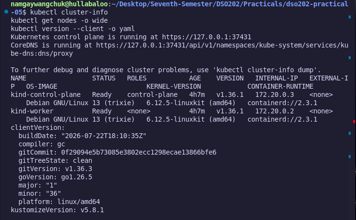

**Note:** the cluster has 1 control-plane and **1 worker** (`kind-worker` only), rather than the 2 workers the lab topology describes. This does not affect any outcome in this practical. Both nodes are `Ready`, and `kubectl`'s built-in Kustomize (`v5.8.1`) is confirmed available via the `-k` flag.

### Task 1 : Repository tree and analysis

```bash
tree examples/webapp
```

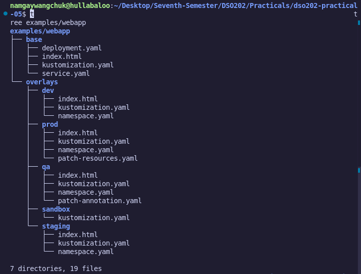

**Analysis, reasoned through *before* rendering anything (as the guide requires):**

| Question | Answer |
|---|---|
| Files existing only once, shared by all environments | `base/deployment.yaml`, `base/service.yaml`, `base/index.html`, `base/kustomization.yaml`; every overlay reuses these via `resources: [../../base]`; none are duplicated. |
| Values that differ between environments | Namespace, `environment` label, replica count, container resource requests/limits (prod only), generated page content (and therefore the generated ConfigMap's hash), and in QA's case; one extra annotation. |
| Where differences are represented | Exclusively inside each `overlays/<env>/kustomization.yaml`, plus a handful of small overlay-local files: a `namespace.yaml`, a per-environment `index.html`, and (for prod/qa) one small patch file. Nothing is expressed by duplicating `deployment.yaml` or `service.yaml`. |

---

## 3. Rendering the Base (Task 2)

```bash
kubectl kustomize examples/webapp/base
```

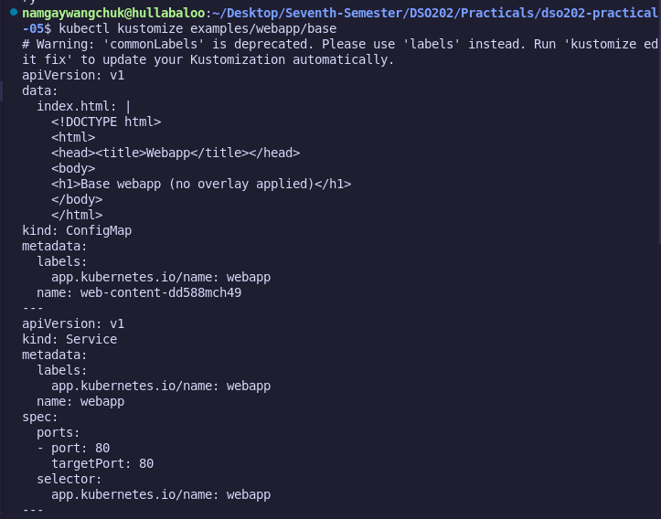

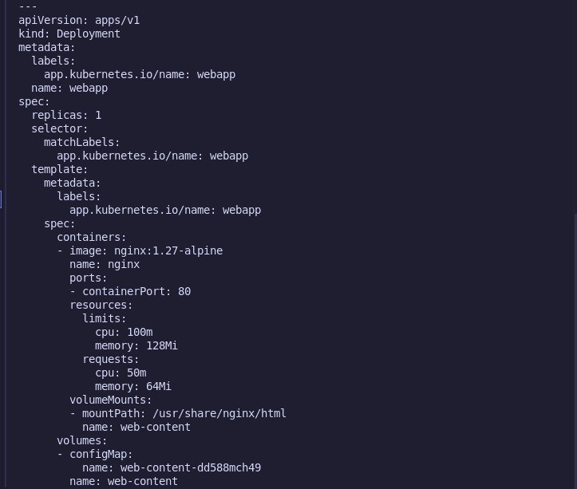

Confirmed:
- Deployment (`kind: Deployment`)
- Service (`kind: Service`)
- Generated ConfigMap with hash suffix (`web-content-dd588mch49`)
- Deployment's `volumes[].configMap.name` reference rewritten to the same hashed name; nothing references the plain name `web-content`

### Checkpoint : why isn't the ConfigMap named exactly `web-content`?

`configMapGenerator` (and `secretGenerator`) append a **content hash** to the generated object's name. As explained in Section 1, this is a deliberate mechanism: Kubernetes never automatically reloads a Pod when a mounted ConfigMap's content changes, so Kustomize encodes the content into the *name* instead. A content change therefore produces a **different name**, and because Kustomize also rewrites every reference to that name (here, the Deployment's `volumes[].configMap.name`), the Deployment's pod template changes too; which the Deployment controller detects as a real spec change and responds to with a normal rolling update. This is verified concretely with real before/after evidence in Section 7.

---

## 4. Comparing Dev vs Prod Offline (Task 3)

```bash
kubectl kustomize examples/webapp/overlays/dev  > /tmp/webapp-dev.yaml
kubectl kustomize examples/webapp/overlays/prod > /tmp/webapp-prod.yaml
diff -u /tmp/webapp-dev.yaml /tmp/webapp-prod.yaml || true
```

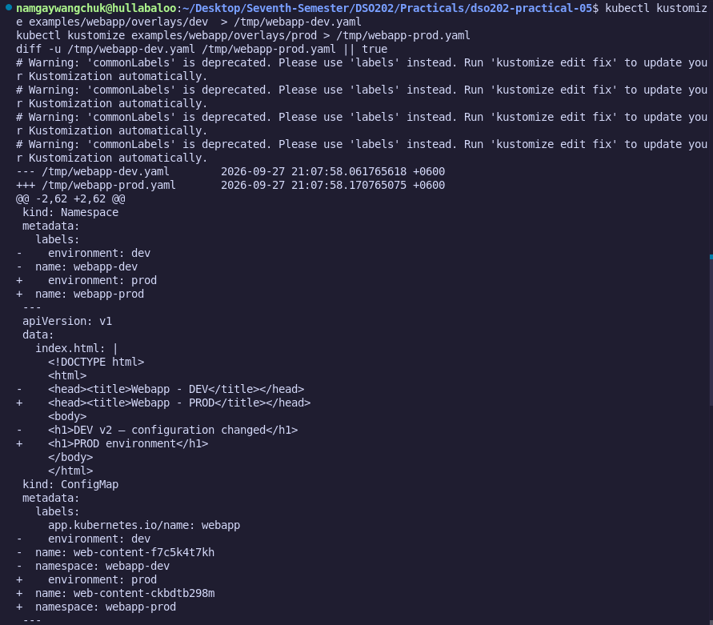

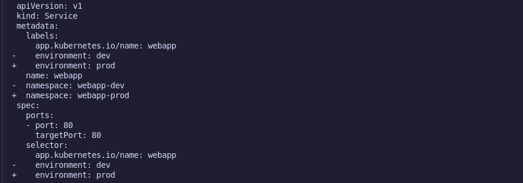

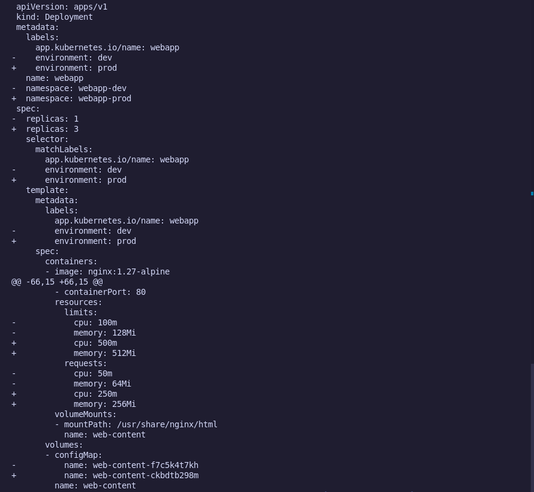

**At least five identified differences:**

| # | Category | Dev value | Prod value |
|---|---|---|---|
| 1 | Namespace | `webapp-dev` | `webapp-prod` |
| 2 | Environment label (`environment:`) | `dev` | `prod` |
| 3 | Replica count | `1` | `3` |
| 4 | Container resources (requests/limits) | `cpu: 50m` / `memory: 64Mi` requests, `cpu: 100m` / `memory: 128Mi` limits | `cpu: 250m` / `memory: 256Mi` requests, `cpu: 500m` / `memory: 512Mi` limits |
| 5 | Generated ConfigMap content / hash | `web-content-9966657d58`, page reads "DEV environment" | `web-content-ckbdtb298m`, page reads "PROD environment" |

**Interesting behavior noticed:** `commonLabels` doesn't only add the `environment` label to each object's `metadata.labels`; it also propagates into the Deployment's `spec.selector.matchLabels`, the Pod template's labels, and the Service's `spec.selector`. This is a `commonLabels`-specific behavior (the field the deprecation warning below nudges you away from); its replacement, `labels:`, exposes an explicit `includeSelectors:` flag so this propagation becomes a deliberate choice rather than an implicit side effect.

---

## 5. Deploying Dev (Task 4)

```bash
kubectl diff -k examples/webapp/overlays/dev || true
kubectl apply -k examples/webapp/overlays/dev
kubectl get all -n webapp-dev
```

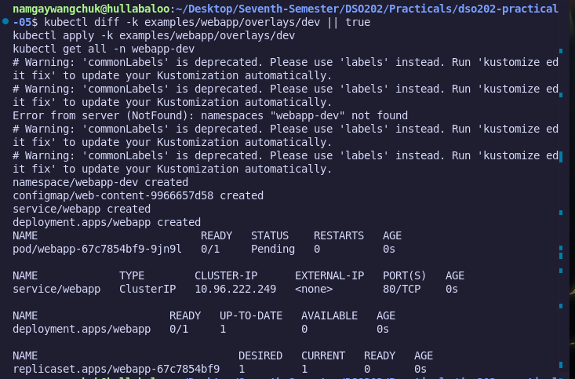

`kubectl diff -k` output:
```text
Error from server (NotFound): namespaces "webapp-dev" not found
```
This is expected, not a failure. On a true first-time apply, `kubectl diff` cannot diff resources living inside a namespace that doesn't yet exist on the server, since the namespace itself is one of the objects about to be created. It does not block `apply`.

`kubectl apply -k` output:
```text
namespace/webapp-dev created
configmap/web-content-9966657d58 created
service/webapp created
deployment.apps/webapp created
```
The ConfigMap hash (`9966657d58`) matches exactly what was predicted during the offline render in Section 4; confirming the render-then-apply workflow produces deterministic, predictable object names.

`kubectl get all -n webapp-dev` (immediately after apply; pod still scheduling):
```text
NAME                          READY   STATUS    RESTARTS   AGE
pod/webapp-67c7854bf9-9jn9l   0/1     Pending   0          0s

NAME              TYPE        CLUSTER-IP      EXTERNAL-IP   PORT(S)   AGE
service/webapp    ClusterIP   10.96.222.249   <none>        80/TCP    0s

NAME                     READY   UP-TO-DATE   AVAILABLE   AGE
deployment.apps/webapp   0/1     1            0           0s

NAME                                DESIRED   CURRENT   READY   AGE
replicaset.apps/webapp-67c7854bf9   1         1         0       0s
```

`kubectl get all -n webapp-dev` (94s later; fully healthy):

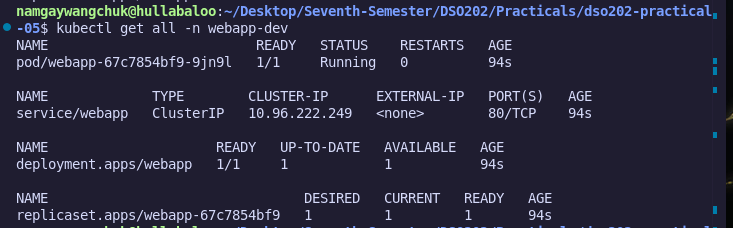


Expected objects all present and healthy: Deployment `webapp`, its ReplicaSet, its Pod, and Service `webapp` (ClusterIP, port 80).

---

## 6. Reaching the Application (Task 5)

```bash
kubectl port-forward -n webapp-dev service/webapp 8081:80
```
> Port `8080` was already bound by another process on the local machine, so `8081` was used instead; this has no effect on correctness, `port-forward` simply tunnels whichever local port you choose to the Service's port `80`.

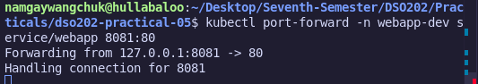

In a second terminal:
```bash
curl http://127.0.0.1:8081
```

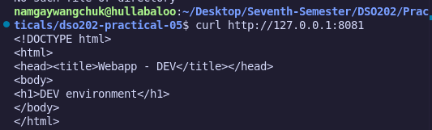

This confirms the full path end-to-end: `overlays/dev/index.html` → `configMapGenerator` → generated ConfigMap `web-content-9966657d58` → mounted into the Deployment's Pod at `/usr/share/nginx/html` → served by nginx → reached through the Service via `port-forward`.

---

## 7. The ConfigMap Hash → Rollout Chain (Task 6)

This is the centerpiece evidence of the practical proving, with real before/after cluster state, that a ConfigMap content change results in a genuine, observable rolling update.

### Before

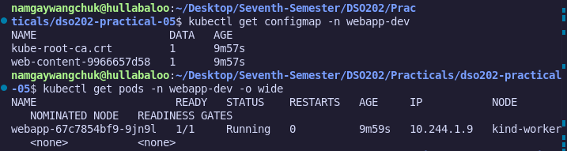

### The change

`overlays/dev/index.html` was edited to:
```html
<h1>DEV v2 — configuration changed</h1>
```

**Rendered offline, before touching the cluster:**
```bash
kubectl kustomize examples/webapp/overlays/dev | grep 'name: web-content'
```

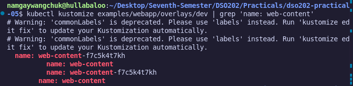

The hash changed from `9966657d58` → **`f7c5k4t7kh`**, computed purely from the edited file content, entirely offline; no cluster call was made yet.

### Applying it

```bash
kubectl apply -k examples/webapp/overlays/dev
kubectl rollout status deployment/webapp -n webapp-dev
```

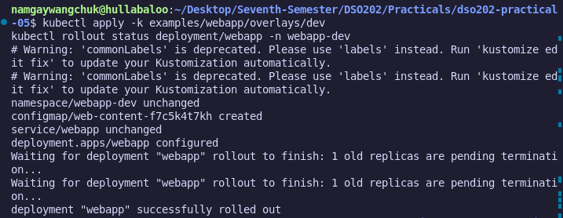

### After

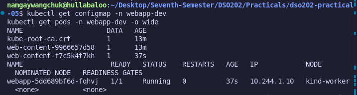


| Stage | ConfigMap | Pod |
|---|---|---|
| Before | `web-content-9966657d58` | `webapp-67c7854bf9-9jn9l` |
| After | `web-content-f7c5k4t7kh` | `webapp-5dd689bf6d-fqhvj` |

The pod's ReplicaSet-derived hash changed from `67c7854bf9` → `5dd689bf6d`, and the pod name changed entirely; direct proof that a **new ReplicaSet** was created and the old Pod was terminated in favor of a fresh one mounting the new ConfigMap, not merely relabeled in place.

**Observation:** the old ConfigMap (`web-content-9966657d58`) was **not automatically deleted** by `kubectl apply -k`; it was left behind as an orphan alongside the new one. Kustomize's generators don't prune superseded objects unless pruning is explicitly requested (`kubectl apply -k ... --prune`) or they're cleaned up manually. This is a real operational consideration: repeated config changes over time can accumulate stale generated ConfigMaps/Secrets in a namespace if nothing ever prunes them.

### The chain, explained

```
index.html content changed
  → configMapGenerator recomputes the content hash
  → generated ConfigMap receives a NEW name (old-hash → new-hash)
  → the Deployment's pod template references the ConfigMap by name
  → Kustomize rewrites that reference to the new hashed name
  → the pod template spec differs from what's live in the cluster
  → the Deployment controller detects template drift
  → a new ReplicaSet is created and scaled up; the old one is scaled down
  → new Pods are scheduled mounting the new ConfigMap; old Pods terminate
```

This mechanism exists because Kubernetes does not automatically restart or reload Pods when a ConfigMap's content changes in place. By encoding content into the object's name, Kustomize turns a silent, easy-to-miss configuration drift into a name change; which the Deployment controller treats like any other pod-template change, triggering a proper, observable rolling update with the usual safety guarantees (readiness gating, controlled pod replacement).

---

## 8. Deploying Staging and Prod (Task 7)

```bash
kubectl diff -k examples/webapp/overlays/staging || true
kubectl apply -k examples/webapp/overlays/staging

kubectl diff -k examples/webapp/overlays/prod || true
kubectl apply -k examples/webapp/overlays/prod
```

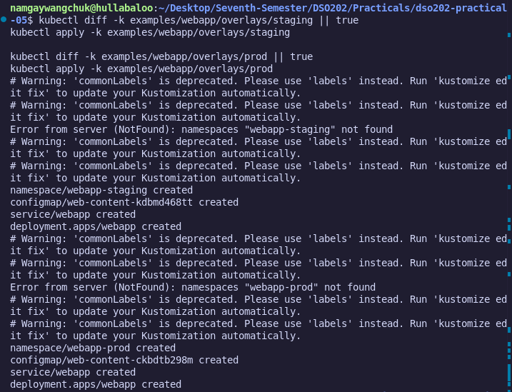

(Both preceded by the same expected `Error from server (NotFound)` message from `kubectl diff -k` on first-time apply, as explained in Section 5.) Note the prod ConfigMap hash `ckbdtb298m` matches exactly the value predicted in Section 4's offline diff.

Cross-environment comparison:
```bash
kubectl get deploy -A -l app.kubernetes.io/name=webapp
kubectl get pods -A -l app.kubernetes.io/name=webapp -o wide
```
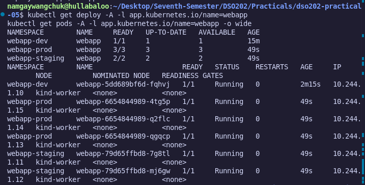


All three environments are visible in a single query via the shared `app.kubernetes.io/name=webapp` label combined with `-A` (all-namespaces); exactly matching the replica counts each overlay's `kustomization.yaml` specifies (1 / 2 / 3), all Pods `Running` with matching `READY`/`AVAILABLE` counts.

| Environment | Namespace | Replica count |
|---|---|---|
| Dev | `webapp-dev` | 1 |
| Staging | `webapp-staging` | 2 |
| Prod | `webapp-prod` | 3 |
| QA | `webapp-qa` | 2 |

---

## 9. Prod Resource Patch Analysis (Task 8)

`overlays/prod/patch-resources.yaml` (strategic merge patch):
```yaml
apiVersion: apps/v1
kind: Deployment
metadata:
  name: webapp
spec:
  template:
    spec:
      containers:
        - name: nginx
          resources:
            requests:
              cpu: 250m
              memory: 256Mi
            limits:
              cpu: 500m
              memory: 512Mi
```

Rendered on the live cluster:
```bash
kubectl kustomize examples/webapp/overlays/prod | grep -A6 'resources:'
```

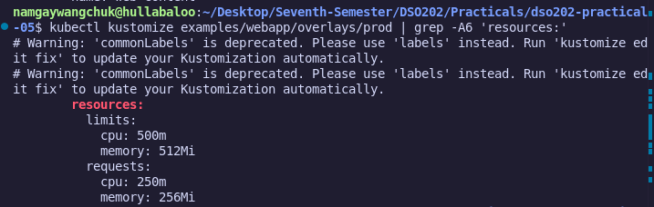

Matches the patch file exactly, confirming it applied correctly.

**Answers:**

1. **Merged, not deleted.** A strategic merge patch combines with the base field-by-field. Only fields explicitly named in the patch are overwritten; every base field the patch doesn't mention (e.g. an unrelated field elsewhere in `resources`) survives untouched unless a `$patch: delete` directive or explicit removal is used.
2. **Prod owns the production resource policy.** Resource sizing appropriate to production load is a prod-specific operational concern and correctly lives only in `overlays/prod/`, never leaking into `base/`, where dev/staging would then inherit production-sized limits unnecessarily.
3. **A patch beats copying `deployment.yaml`** because it: (a) keeps future base changes (new labels, a new probe, an image bump) automatically propagating to prod with zero prod-side edits; (b) keeps the prod-specific *intent* legible in five lines instead of hidden inside a full duplicate manifest; (c) minimizes configuration drift risk between environments; the central failure mode Kustomize exists to prevent.

---

## 10. The QA Overlay (Task 9)

```text
overlays/qa/
├── index.html
├── kustomization.yaml
├── namespace.yaml
└── patch-annotation.yaml
```

**`namespace.yaml`:**
```yaml
apiVersion: v1
kind: Namespace
metadata:
  name: webapp-qa
```

**`kustomization.yaml`:**
```yaml
apiVersion: kustomize.config.k8s.io/v1beta1
kind: Kustomization

namespace: webapp-qa

resources:
  - ../../base
  - namespace.yaml

commonLabels:
  environment: qa

replicas:
  - name: webapp
    count: 2

configMapGenerator:
  - name: web-content
    behavior: replace
    files:
      - index.html

patches:
  - path: patch-annotation.yaml
    target:
      kind: Deployment
      name: webapp
```

**`patch-annotation.yaml`** (JSON 6902; deliberately different patch type from Task 8's strategic merge, per the task's own requirement):
```yaml
- op: add
  path: /metadata/annotations
  value:
    training.example.com/owner: qa-team
```

**`index.html`:**
```html
<!DOCTYPE html>
<html>
<head><title>Webapp - QA</title></head>
<body>
<h1>QA environment</h1>
</body>
</html>
```

Rendered confirmation (key fields):
```text
kind: Namespace
kind: ConfigMap
  name: web-content-4t7mf7ggkh
  namespace: webapp-qa
kind: Service
  namespace: webapp-qa
kind: Deployment
  annotations:
    training.example.com/owner: qa-team
  namespace: webapp-qa
  replicas: 2
```

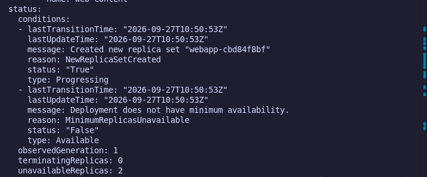


Applied to the real cluster:
```bash
kubectl diff -k examples/webapp/overlays/qa || true
kubectl apply -k examples/webapp/overlays/qa
kubectl rollout status deployment/webapp -n webapp-qa
```

Pod status after rollout:

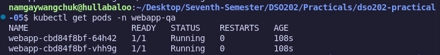

2/2 Pods Running, matching `replicas: 2`.

Annotation verification on the live cluster:
```bash
kubectl get deployment webapp -n webapp-qa -o jsonpath='{.metadata.annotations}'
```
The returned annotations map confirms:
```json
"annotations":{"training.example.com/owner":"qa-team"}
```
Direct confirmation, on the real cluster, that the JSON 6902 patch reached the live Deployment object exactly as rendered offline.

---

## 11. Strategic Merge Patch vs. JSON 6902 Patch

| Aspect | Strategic Merge Patch | JSON 6902 Patch |
|---|---|---|
| Format | A partial Kubernetes manifest (same `apiVersion`/`kind`/`metadata.name` as the target); present fields overwrite, absent fields are left alone | An ordered list of RFC 6902 operations (`add`, `remove`, `replace`, `move`, `copy`, `test`) against exact JSON paths |
| Merge behavior | Field-aware; understands Kubernetes-specific merge keys for lists (e.g. merges `containers` by `name` rather than replacing the whole array) | Path-exact; no semantic awareness of Kubernetes list merge keys; list elements are referenced by index, or appended with `-` |
| Best suited for | Broad, structural changes: adjusting `resources`, changing `env`, modifying a named `container` block | Precise, surgical changes: adding one annotation/label key, removing one specific field, inserting at one array position |
| Readability | Reads like "here's the delta of the object" | Reads like "here's the exact operation to perform" |
| Used in this practical for | Task 8; prod's `patch-resources.yaml` | Task 9; QA's `patch-annotation.yaml` |

**Why the lab deliberately uses both:** it demonstrates that Kustomize isn't a single patching mechanism; the *shape* of the intended change should drive which patch type is used. Using the wrong one for the job (e.g. a JSON 6902 patch to rewrite a large `resources` block) tends to produce brittle, hard-to-read overlays that break the moment the target document's shape changes slightly.

---

## 12. Reflection

While proving the ConfigMap hash → rollout chain in Section 7, I expected the old ConfigMap (`web-content-9966657d58`) to be replaced or removed once the new one (`web-content-f7c5k4t7kh`) was created; after all, `kubectl apply -k` is supposed to bring the cluster in line with the current overlay. Instead, `kubectl get configmap -n webapp-dev` showed **both** ConfigMaps present side by side, with the old one still sitting there unreferenced by anything.

This wasn't visible until I actually ran the "after" `get configmap` check rather than assuming the apply had fully converged; the rendered/applied output looked correct (new ConfigMap created, Deployment rolled out successfully), but the *live cluster state* told a slightly different, more complete story: Kustomize's generator-based approach optimizes for safe rollouts, not automatic cleanup of superseded objects. Cleaning up old generated ConfigMaps/Secrets is left to the operator, either by re-running with `--prune`, or relying on something coarser like full namespace deletion (as Section 13 demonstrates).

The lesson this drove home is that the render → diff → apply → **verify** discipline the guide insists on isn't just about catching mistakes before they reach the cluster; it's equally about not assuming the cluster's final state matches your mental model just because the apply command exited cleanly. The only way I actually knew about the orphaned ConfigMap was because I checked, not because anything failed or warned me about it.

---

## 13. Cleanup (Task 10)

```bash
kubectl delete -k examples/webapp/overlays/dev
kubectl delete -k examples/webapp/overlays/staging
kubectl delete -k examples/webapp/overlays/prod
kubectl delete -k examples/webapp/overlays/qa
kubectl get ns | grep 'webapp-' || true
```

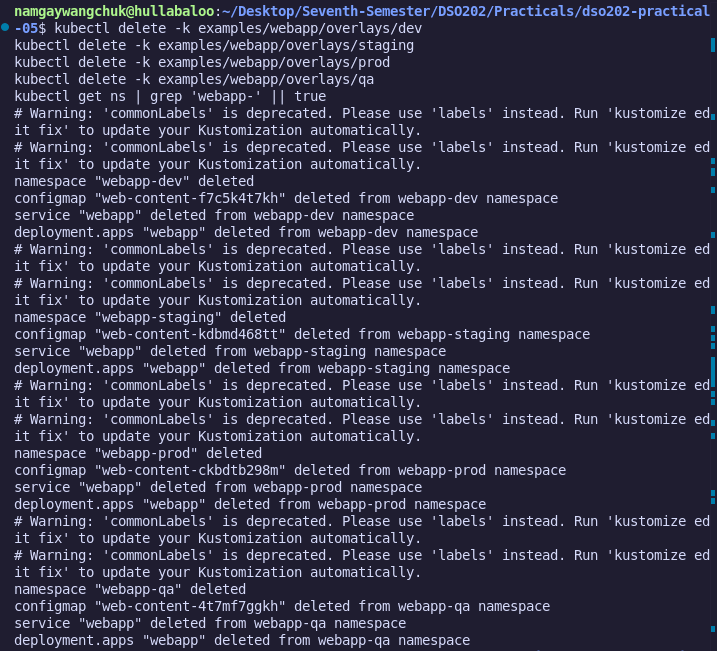


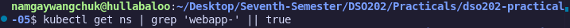

No output returned; all four namespaces (`webapp-dev`, `webapp-staging`, `webapp-prod`, `webapp-qa`) were fully removed, along with every Deployment, Service, and ConfigMap inside them.

**Observation, tying back to Section 7 and Section 12's reflection:** even though `kubectl delete -k` for dev only explicitly targeted the *current* ConfigMap (`web-content-f7c5k4t7kh`), the earlier orphaned ConfigMap (`web-content-9966657d58`) also disappeared; because **deleting the namespace cascades to delete everything inside it**, whether or not Kustomize is still tracking it. Namespace deletion is therefore a reliable way to guarantee a fully clean environment, even after generator-created objects have accumulated beyond what the current `kustomization.yaml` describes.

---

## 14. Challenge Extension; `namePrefix` and Reference-Aware Transformation

`overlays/sandbox/kustomization.yaml`:
```yaml
namePrefix: sandbox-
resources:
  - ../../base
```

**Prediction, made before rendering:**

| Object | Base name | Predicted prefixed name |
|---|---|---|
| Deployment | `webapp` | `sandbox-webapp` |
| Service | `webapp` | `sandbox-webapp` |
| ConfigMap | `web-content-<hash>` | `sandbox-web-content-<hash>` |
| Pod labels / Service selector values | unchanged (not object names) | unchanged (not object names) |
| Deployment's ConfigMap volume reference | `web-content-<hash>` | `sandbox-web-content-<hash>` (rewritten) |

**Actual rendered output** (key fields):
```text
kind: ConfigMap
    app.kubernetes.io/name: webapp
  name: sandbox-web-content-dd588mch49
kind: Service
    app.kubernetes.io/name: webapp
  name: sandbox-webapp
  selector:
    app.kubernetes.io/name: webapp
kind: Deployment
    app.kubernetes.io/name: webapp
  name: sandbox-webapp
  selector:
    matchLabels:
      app.kubernetes.io/name: webapp
```

**Prediction vs. actual; match? Yes, exactly.** Both the Deployment and Service object names received the `sandbox-` prefix; the generated ConfigMap's already-hashed name also received the prefix, and the Deployment's volume reference to that ConfigMap was rewritten in lockstep. Meanwhile the `app.kubernetes.io/name: webapp` value; used identically as a Pod label, a Deployment `matchLabels` selector, and a Service `selector`; was left completely untouched everywhere it appears, because it is a label *value*, not an object *name*.

**Learning target achieved:** Kustomize maintains an internal model distinguishing *name-reference fields* (rewritten consistently; ConfigMap/Secret names inside volumes and env vars, cross-referenced Service names) from *opaque label/selector values* (left untouched, since they aren't object identities). Correctly predicting which fields change; and which stay the same; before rendering demonstrates real understanding of Kustomize's transformation model, not just familiarity with its syntax.

---

## 15. Conclusion

This practical walked through the complete Kustomize workflow for managing four parallel environments (dev, staging, prod, and a custom QA tier) from a **single shared base**, and validated every step against a real Kind cluster rather than relying on rendered output alone:

- **Declarative transformers** (`namespace`, `commonLabels`, `replicas`) expressed every environment difference in a handful of lines per overlay, with zero duplication of the underlying Deployment or Service.
- **`configMapGenerator`'s content-hash naming** was proven, with real before/after cluster evidence (Section 7), to convert an otherwise-silent configuration change into a genuine, observable rolling update; new ConfigMap name, new ReplicaSet, new Pod.
- **Strategic merge patches** (prod's resource sizing) and **JSON 6902 patches** (QA's single annotation) were both used deliberately, matched to the shape of the change each was solving.
- The **render → diff → apply → verify** discipline caught expected-but-unusual behavior (the `NotFound` diff error on first apply) without it ever being mistaken for a real failure, and as the reflection in Section 12 captures; surfaced an unadvertised orphaned-ConfigMap behavior that only became visible by actually checking live cluster state rather than trusting a clean `apply` exit code.
- **Cleanup via namespace deletion** proved to be the reliable way to guarantee a fully clean environment, cascading correctly even to objects the current `kustomization.yaml` was no longer tracking.

Taken together, the exercise demonstrates Kustomize's central value proposition concretely: environment-specific Kubernetes configuration that stays legible, low-drift, and auditable, without ever introducing a templating language into the manifests themselves.